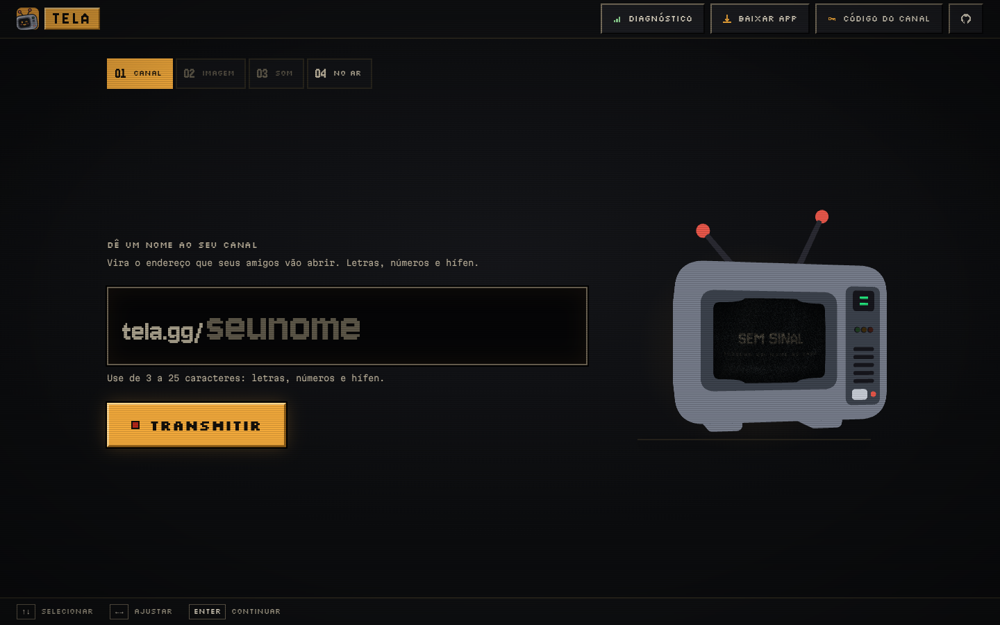
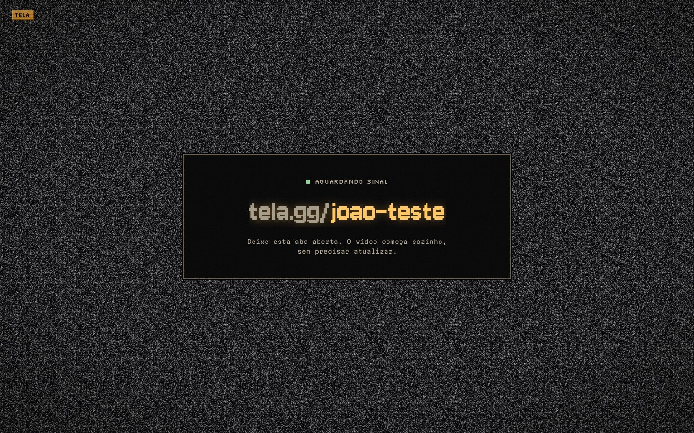

<div align="center">


# Tela

**Mostre seu jogo para os amigos, ao vivo, sem atraso e sem cadastro.**

Gameplay em 1080p60 do seu PC direto para o navegador de quem tem o link.
Sem servidor de mídia no meio, sem conta e sem custo.

[**Transmitir agora**](https://tela.transmissao.workers.dev) ·
[**Baixar o app**](https://github.com/joaoviitorsx/Tela/releases) ·
[Como funciona](#como-funciona) ·
[Rodar localmente](#rodar-localmente)

[](https://github.com/joaoviitorsx/Tela/actions/workflows/ci.yml)
[](https://github.com/joaoviitorsx/Tela/actions/workflows/desktop.yml)
[](https://github.com/joaoviitorsx/Tela/releases)
[](LICENSE)



</div>

---

## Por que existe

Em 17 de agosto de 2026 a ANPD suspendeu o compartilhamento de tela do Discord
no Brasil. Texto e voz continuaram funcionando. Só a transmissão de vídeo parou.

Quem mostrava o jogo para os amigos durante a call ficou sem ferramenta. Twitch
e YouTube atrasam de 3 a 15 segundos, e a conversa perde o sentido. Meet e
Jitsi têm cara de reunião de trabalho. Parsec é controle remoto, não plateia.

O Tela resolve só esse caso. Vocês continuam conversando no Discord, e o Tela
leva o vídeo.

## Como usar

**Para transmitir**

1. Abra [tela.transmissao.workers.dev](https://tela.transmissao.workers.dev) no
   Chrome ou no Edge, ou abra o [app](#app-desktop).
2. Dê um nome ao canal. O link fica `…/seunome` e não muda entre uma
   transmissão e outra.
3. Escolha a tela ou a janela do jogo e aperte **TRANSMITIR**.
4. Mande o link na call. Pronto.

**Para assistir:** abra o link. Não precisa de conta nem de instalar nada, e a
aba pode ficar aberta antes de a transmissão começar, porque o vídeo entra
sozinho.

<div align="center">

</div>

## O que ele faz

| | |
|---|---|
| **1080p60 com atraso de chamada de voz** | A imagem vai direto do seu PC para cada amigo por WebRTC. O projeto mira ~150 ms entre a tela e a tela deles |
| **Até 50 espectadores** | O vídeo é codificado uma vez só e enviado para todos ([ADR 0029](docs/adr/0029-um-encode-e-teto-de-50.md)). O mesmo teto do Go Live do Discord. Navegadores sem esse recurso ficam em 5 |
| **Sem cadastro** | Sem e-mail e sem senha. O canal é seu enquanto você transmite, e um código de recuperação leva ele para outro aparelho |
| **Som do jogo, sem a call** | No app, **SISTEMA** leva tudo que toca no PC menos a voz do Discord, e **SÓ O JOGO** leva um programa só. Ninguém ouve a própria voz de volta |
| **Não pesa no jogo** | Encoder em hardware, um encode para todos, captura a 5 fps quando ninguém está assistindo e um teto de banda que deixa folga para o ping do jogo |
| **Qualidade que se ajusta sozinha** | A banda escolhe a resolução, e não só o bitrate: 480p nítido em vez de 1080p borrado. Todos descem e sobem juntos, e o console mostra o motivo |
| **Pausa de privacidade** | Esconde a tela na hora (senha, mensagem, notificação) sem derrubar ninguém. No app, `Ctrl+Shift+O` |
| **Multivisão** | Quem assiste pode abrir dois canais na mesma tela, o segundo em PiP, com as partidas sincronizadas ([ADR 0032](docs/adr/0032-multivisao.md)) |
| **Integração com o Discord** | O link colado no Discord já mostra `AO VIVO · 3 assistindo`, e o comando `/tela canal:seunome` posta o convite com um botão ASSISTIR ([docs/DISCORD.md](docs/DISCORD.md)) |
| **Diagnóstico honesto** | Bits por pixel, banda, CPU, estado do som e motivo de cada degradação, prontos para copiar e mandar |

## App desktop

O site funciona sozinho. O app é para quem quer mais:

- som do sistema sem a call, ou só o som do jogo, no Windows e no Linux;
- encoder nativo NVENC em placas NVIDIA;
- segundo plano, bandeja do sistema e modo compacto enquanto você joga;
- atalho global para ocultar a transmissão;
- links `tela://` que abrem o canal direto no app;
- atualização automática, que nunca roda durante uma transmissão.

| Sistema | Arquivo |
|---|---|
| Windows 10/11 x64 | `Tela-<versão>-win-x64.exe` |
| Linux (qualquer distro) | `Tela-<versão>-linux-x86_64.AppImage` |
| Fedora | `Tela-<versão>-linux-x86_64.rpm` |
| Ubuntu / Debian | `Tela-<versão>-linux-amd64.deb` |

Tudo em [Releases](https://github.com/joaoviitorsx/Tela/releases). O app está
em **beta**, e o instalador do Windows não é assinado: o SmartScreen vai
reclamar, e os hashes SHA-256 de cada arquivo estão no release para conferir.
Detalhes em [docs/desktop/BETA.md](docs/desktop/BETA.md).

## Som do jogo

| Onde | Como funciona |
|---|---|
| **App (Windows e Linux)** | Escolha **SISTEMA** (tudo menos a call) ou **SÓ O JOGO**. Não precisa configurar nada |
| **Chrome no Windows** | No seletor, escolha a **janela do jogo** (Chrome 141+) ou **Tela inteira**, e marque *Compartilhar áudio*. A tela inteira leva a call junto, e o Tela avisa |
| **Chrome no Linux** | O navegador não entrega o som do sistema. Use o app, ou o script `scripts/audio-linux.sh` com um sink virtual. A tela inicial explica o passo a passo |
| **macOS** | Fora do escopo por enquanto: o sistema exige um driver de terceiros |

O som sai em estéreo de verdade (um tom só na esquerda chega só na esquerda), a
128 kbps, sem nenhum processamento de voz.

## Privacidade

| Dado | Coletado? |
|---|---|
| Nome, e-mail, telefone, senha | Não |
| Cookie de rastreamento, analytics | Não |
| Gravação de vídeo ou áudio | Não |
| Vídeo passando por um servidor nosso | Não, é P2P. Só quem está atrás de CGNAT usa um relay TURN, que repassa pacotes cifrados |
| Seu IP | Quem transmite vê o IP de quem assiste, como em qualquer conexão P2P. No repasse em cascata, quem repassa e quem recebe dele também se veem |
| Nome do canal e hashes do token | Em memória, enquanto o canal existe |
| Diagnóstico da transmissão | Só no seu navegador. Sai daí quando você copia e manda |

Não existe login. Um token de 32 bytes guardado no navegador é a credencial do
canal, e `/recuperar` exporta esse token para outro aparelho.

---

## Como funciona

```
┌───────────────────────────────────────────────┐
│  Front estático · Cloudflare                  │
│  React + core/ (portável) + adapters/         │
└─────────────────────┬─────────────────────────┘
                      │ WebSocket: só SDP e ICE, nunca mídia
                      ▼
┌───────────────────────────────────────────────┐
│  Sinalização · Durable Objects                │
│  um objeto por canal, repassa payload opaco   │
│  hiberna com os sockets abertos               │
└───────────────────────────────────────────────┘

           STUN público · TURN só para CGNAT

                  ┌──────────────┐
  captura ──► 1 encoder ──► isca + Encoded Transform ──┬──► espectador 1
                  └──────────────┘                     ├──► espectador 2
                                                       ├──► …
                                                       └──► repassador ──► espectadores
```

**O servidor não vê um byte de mídia.** Ele repassa `payload` opaco e nunca
olha dentro. Isso é regra de lint: ler `.sdp` em `apps/signaling/` quebra o
build. Se a sinalização cair no meio de uma transmissão, quem já está assistindo
continua assistindo. Só quem chega depois não consegue entrar.

**Um encode, N envios.** O Chromium codifica uma vez por conexão, o que daria
50 encoders 1080p60 disputando a GPU com o jogo. O Tela usa um `VideoEncoder`
só, e cada conexão leva uma isca de 32×18 que um Encoded Transform troca pelo
quadro real. O encode é um só, e por espectador sobra só o custo pequeno da
isca ([ADR 0029](docs/adr/0029-um-encode-e-teto-de-50.md)).

**Repasse em cascata.** Quando a sua subida não dá conta de todos, espectadores
com banda de sobra repassam o vídeo para outros
([ADR 0031](docs/adr/0031-cascata-de-repasse.md)).

**Núcleo portável.** A lógica de captura, publicação, reconexão e qualidade
mora em classes puras (`BroadcastSession`, `ViewerSession`) atrás de portas
(`MediaTransport`, `SignalingChannel`). O projeto já trocou o transporte inteiro
de SFU para mesh P2P sem mexer nelas, e o mesmo núcleo roda no site e no app.

### Decisões que parecem erradas à primeira vista

**Parâmetros de encoding idênticos para todos.** Adaptar por espectador parece
justo, mas acaba com o "um encode". A adaptação é coletiva: ou cada um aguenta o
que está sendo enviado, ou todos descem juntos um degrau. Há teste que quebra se
alguém tentar "otimizar" isso.

**`contentHint = 'motion'`.** Por padrão o Chrome trata captura de tela como
documento: mantém a nitidez e derruba o framerate. Gameplay nítido a 15 fps não
serve para nada. O modo **nitidez** existe para quando o detalhe importa (mapa,
inventário, texto) e troca três coisas juntas: `detail`,
`maintain-resolution` e 30 fps.

**H.264 como piso.** VP9 e AV1 comprimem melhor, mas em software gastam a CPU
que o jogo precisa, e H.264 tem encode em hardware em qualquer GPU dos últimos
doze anos. A sala sobe para AV1 sozinha quando quem transmite tem encoder AV1 em
hardware e todos os espectadores decodificam bem
([ADR 0035](docs/adr/0035-av1-no-codificador-unico.md)).

**Todo orçamento vira resolução antes de virar bitrate.** Apertar bits sem tirar
pixel só sobe o QP, e a imagem borra. O console mostra os bits por pixel:
abaixo de 0,10 a imagem borra, e acima de 0,13 o bit extra quase não aparece
na imagem ([ADR 0015](docs/adr/0015-o-teto-de-upload-escolhe-o-degrau.md),
[0017](docs/adr/0017-o-governador-mede-orcamento-nao-teto.md); o teto atual é
`BPP_TETO` em [`packages/shared/src/encoding.ts`](packages/shared/src/encoding.ts)).

### Limitações conhecidas

São consequências da arquitetura, e não bugs esperando conserto:

- **Sua subida é o teto.** Sem servidor de mídia, cada espectador recebe uma
  cópia. O repasse alivia, mas não faz milagre, e o Tela mostra quando a banda
  limitou a qualidade.
- **Cerca de 15–20% das conexões precisam de TURN.** CGNAT simétrico não deixa a
  conexão direta passar. Nenhuma topologia sem servidor atende 100% das redes.
- **O nome do canal não é reservado para sempre.** A sinalização não guarda nada
  em disco. O nome é seu enquanto você transmite, mais 5 minutos para reconectar.
- **Medições que dependem de gente.** Atraso glass-to-glass, impacto no FPS com
  10 espectadores e o sucesso de ICE em operadoras brasileiras exigem máquina,
  rede e amigos reais. Os roteiros estão em [`docs/qa/`](docs/qa/).

---

## Rodar localmente

Requer Node 22+ e pnpm.

```bash
pnpm install
pnpm dev            # sinalização em :3333 + web em :5173
```

Não há Docker, banco nem servidor de mídia.

```bash
pnpm turbo lint typecheck test build   # o portão de toda entrega
pnpm depcruise                         # ciclos de dependência
pnpm e2e                               # malha, estéreo L/R, pausa e teto de espectadores em dois Chromium
node e2e/malhas.sim.mjs                # 1200 cenários das malhas de controle
```

São mais de 1.900 testes que rodam sem navegador e sem rede: a mídia vive em
classes puras com `RTCPeerConnection` injetada, então a negociação inteira roda
em milissegundos. Os e2e cobrem o que só um navegador consegue provar.

A abertura 3D tem atalhos na URL: `/?abertura=0` pula a animação e
`/?abertura=t1.35` congela o quadro naquele instante.

### Estrutura

```
apps/
  web/         site e renderer do app (React + core/ portável)
  desktop/     app Electron: captura nativa, som, NVENC, bandeja, atualização
  signaling/   sinalização: Node portátil e Durable Object
packages/
  shared/      protocolo, schemas e presets de encoding
docs/
  adr/         decisões e seus motivos
```

O app desktop tem o próprio passo a passo em
[docs/desktop/PLANO-desktop.md](docs/desktop/PLANO-desktop.md), e o deploy está
em [docs/DEPLOY.md](docs/DEPLOY.md).

## Contribuindo

Leia o [`AGENTS.md`](AGENTS.md) antes: ele tem as oito regras do projeto. As
mais importantes são o núcleo sem React, nenhum SDK de SFU, erro esperado como
`Result` e escopo fechado. Este produto **não** vai ter chat, voz, contas,
gravação, diretório público nem seguidores, porque isso o Discord já faz.

Decisões ficam registradas em [`docs/adr/`](docs/adr/). Comece pela
[0005](docs/adr/0005-mesh-p2p.md), que explica a arquitetura atual. Mudanças nos
parâmetros de mídia precisam de uma ADR nova.

Bugs e ideias vão em [Issues](https://github.com/joaoviitorsx/Tela/issues).
Para problemas de transmissão, anexe o texto do **DIAGNÓSTICO**: ele já traz o
que importa e nada pessoal.

## Licença

[AGPL-3.0](LICENSE). Use, estude, modifique e hospede o seu próprio Tela à
vontade. Se você oferecer uma versão modificada para outras pessoas usarem pela
rede, o código dela também precisa ser aberto. É isso que garante que qualquer
Tela por aí possa ser conferido: sem rastreamento, e sem mídia passando por
servidor.
