# Auditoria de UI/UX e IHC do Tela

**Data:** 2026-10-02 · **Escopo:** site (home e assistente de 4 passos, console ao vivo, espectador, `/recuperar`, 404) e o renderer do Tela Desktop (`desktop.html`, com trilho)
**Método:** Playwright com Chromium headless (nenhuma janela visível), dev server em `:5173` e signaling em `:3333`, renderer desktop servido em `:5175`. Transmissor real da própria aplicação, com `getDisplayMedia` trocado por um canvas 1920×1080@60 (`addInitScript`); espectadores reais em outros contextos do navegador. Capturas em `docs/ux/capturas/` (60 PNGs, 5,7 MB, paleta reduzida para caber no limite). Código lido: `Home.tsx`, `Broadcast.tsx`, `Viewer.tsx`, `OfflineState.tsx`, `BarraEspectador.tsx`, `Recover.tsx`, `TrilhoDesktop.tsx`, `globals.css`, ADRs 0013/0022 e `PLANO-desktop.md` §11.

> **Limites desta auditoria (AGENTS.md, "O que você NÃO consegue verificar").** Não há GPU, tela real, nem rede real. Números de FPS, frames descartados, tempo até o primeiro quadro e CPU vêm de Chromium headless com renderização por software em `localhost`: servem para comparar telas entre si e achar defeitos, não como medida de produto. A seção 8 lista o que precisa de humano.

**Escala de severidade (Nielsen):** 0 não é problema · 1 cosmético · 2 menor · 3 maior · 4 catastrófico. **Esforço:** XS (menos de 1 h) · S (até meio dia) · M (1 a 2 dias) · L (mais de 2 dias).

---

## 1. Resumo executivo

O Tela tem uma identidade forte e coerente (âmbar sobre preto, numerais de placar, OSD) e, nas partes que importam para o produto, decisões de UX acima da média: o vídeo do jogo nunca leva scanline (verificado: `.crt-vidro` nem é montado no espectador, e no console o vídeo está acima da camada, z-index 41); a barra do espectador some em 2 s e volta com o teclado; a sala de espera explica o que fazer ("Deixe esta aba aberta"); os estados de erro têm texto por causa (R4). Todos os alvos de toque medidos na home e em `/recuperar` têm pelo menos 44×44 px, o anel de foco é de 13,2:1 e `prefers-reduced-motion` desliga mesmo a animação (zero animações ativas medidas).

Os problemas reais estão em quatro lugares:

1. **Teclado no espectador está quebrado.** O atalho global de Espaço (silenciar) chama `preventDefault` em qualquer elemento que não seja `<input>`. Medido: com foco em "Aumentar zoom", Espaço não faz nada; só Enter funciona. Falha de WCAG 2.1.1 e 4.1.2 (nível A) em todos os botões da barra. É o achado de maior risco e o mais barato de consertar.
2. **O assistente esconde a ação principal e a causa dos erros.** No passo 2 o botão "CONTINUAR" fica em y=895 em 1440×900, 1366×768 e 1280×720: abaixo da dobra em todas as telas de notebook. "Nome já em uso" só aparece depois de três passos e do seletor de tela, com o título "SEM SINAL" e barras de teste vermelhas, o mesmo título de cancelar o compartilhamento, de falha de captura e de servidor fora do ar.
3. **O console ao vivo tem defeitos visíveis.** O popover da Sala fica cortado atrás da prévia do vídeo; "QUADROS" mostra `59.441252229134705fps`; ENCERRAR usa `window.confirm` do navegador (quebra a identidade, diz "pessoa(s)") e fica a 8 px de TROCAR FONTE.
4. **O espectador no celular e o app desktop não receberam o mesmo acabamento.** Em celular na horizontal a barra come 31% da altura; no desktop o rótulo do trilho ("TRANSMITIR") sai cortado ("RANSMITIR"), e o trilho inteiro fica desabilitado ao vivo.

Fora esses, há ajustes de contraste (o `dim` cai de 5,14:1 para ~3,8:1 sob as scanlines no pior caso), a tela `/recuperar` que exibe o código de propriedade do canal em texto claro (justo no produto cuja atividade é compartilhar a tela), e a oportunidade de desenhar o modo "ASSISTIR" do app e o "Abrir no app" da web (seção 7).

### O que está bom (para não ser desfeito por engano)

- Hierarquia da sala de espera: canal em numeral grande, o que está acontecendo, o que fazer (`OfflineState.tsx`). O texto é por motivo, não por código de erro.
- "Sintonizando" avança por etapa real da sessão, não por relógio (`etapa`: procurando e negociando).
- Console ao vivo avisa a degradação ("! Rede no limite — reduzindo qualidade"), marca no seletor qual degrau está de fato no ar ("720p60 NO AR") e a tela final mostra "ÚLTIMA QUALIDADE".
- Tela "FIM DA TRANSMISSÃO": resumo (tempo, pico de amigos, qualidade) e o primário "TRANSMITIR DE NOVO".
- Passos anunciados por `role="status"`, trilha em `<ol>` com `aria-current="step"`, radiogroups e sliders com nome.
- Chrome do espectador some com opacidade (sem reflow) e continua focável.

---

## 2. Top 15 propostas (impacto × facilidade)

Pontuação = Impacto (1 a 5) × Facilidade (5 = XS, 4 = S, 3 = M, 2 = L). Ordenado pela pontuação, desempate por severidade.

| # | Proposta | Tela | Sev | Imp | Esf | Pts | Achado |
|---|---|---|:-:|:-:|:-:|:-:|---|
| 1 | Atalhos do espectador: não interceptar Espaço/Enter quando o alvo é botão, link ou slider; teclas de uma letra só com o palco focado e com opção de desligar | Espectador | 3 | 5 | S | 20 | A-01 |
| 2 | Passo 2: encolher a prévia e fixar o rodapé (VOLTAR / CONTINUAR) na base da janela | Assistente | 3 | 5 | S | 20 | B-01 |
| 3 | Erro por causa: título próprio por motivo, cancelamento sem tom de alarme, botão certo para cada caso ("ESCOLHER OUTRO NOME" leva ao passo 1) | Pós "IR AO AR" | 3 | 5 | S | 20 | B-02, B-03 |
| 4 | Popover da Sala no top layer (`popover`/`dialog`) para não ficar atrás da prévia | Console | 3 | 4 | S | 16 | C-01 |
| 5 | ENCERRAR: diálogo do Tela (foco em "CONTINUAR NO AR"), separar de TROCAR FONTE | Console | 3 | 4 | S | 16 | C-03 |
| 6 | Detectar "sem `getDisplayMedia`" (celular) na home e orientar antes de gastar 3 passos | Home | 2 | 4 | S | 16 | B-06 |
| 7 | Espectador: avisar quando a transmissão termina e, esperando, mudar título/favicon (e bipe opcional) quando entrar no ar | Espectador | 2 | 4 | S | 16 | V-03, V-04 |
| 8 | Trilho desktop: corrigir o rótulo cortado, renomear "CANAL", tirar o duplicado do cabeçalho, mostrar o painel NO AR | Desktop | 3 | 4 | S | 16 | D-01 a D-04 |
| 9 | Corrigir o número cru (`59.441252229134705fps` vira `59 fps`) no console e no diagnóstico | Console | 2 | 3 | XS | 15 | C-02 |
| 10 | `/recuperar`: código mascarado por padrão, confirmação antes de RESTAURAR, aviso de captura de tela | Recuperar | 3 | 4 | M | 12 | R-01 |
| 11 | Barra do espectador em celular: versão compacta de uma linha na horizontal; toque alterna | Espectador mobile | 3 | 4 | M | 12 | V-01, V-02 |
| 12 | Contraste: `dim` para `#9a927f`, "04 NO AR" fora do `faint`, scanline mais fraca sobre texto, TRANSMITIR sem `disabled` | Global | 2 | 3 | S | 12 | W-01 a W-03 |
| 13 | "BAIXAR APP" sem beco sem saída: esconder até haver binário; criar o "Abrir no app" (seção 7) | Global | 2 | 3 | S | 12 | B-07 |
| 14 | Diagnóstico: veredito em português claro no topo, detalhes técnicos atrás de "VER DETALHES" | Console | 2 | 3 | M | 9 | C-05 |
| 15 | Atalho "IR AO AR COM O ÚLTIMO AJUSTE" para quem volta (decisão do dono: o atalho antigo foi removido) | Home | 2 | 3 | M | 9 | B-05 |

Notas de leitura: empates seguem a ordem de execução sugerida. Itens corrigem defeitos (1, 2, 5, 9), reduzem erro e esforço no caminho principal (3, 4, 6, 7, 15) ou fecham desigualdades entre plataformas e telas (8, 9, 10, 11, 14).

---

## 3. Achados por fluxo

Formato: **ID · tela · severidade · heurística violada · evidência · proposta · esforço.** Texto de interface sugerido em português do Brasil, caixa e pontuação como no produto.

### 3.1 Home e abertura

**Observado.** A abertura dura 1,80 s (`DURACAO_ABERTURA`), roda em toda visita (ADR 0013) e qualquer toque, tecla ou roda a pula; a home já está montada e interativa em t=0, e há escudo de 250 ms contra o clique que acompanha o toque que pulou. Medido: o campo `#slug` já é visível 84 ms depois de `/?abertura=1`. Com `prefers-reduced-motion` a abertura vira crossfade de 300 ms e a TV da vitrine fica na pose parada. Intro (1,5 s): `capturas/01-intro-t1.5s-d.png`; quadro congelado `?abertura=t1.35`: `capturas/01-intro-congelado-t1.35-d.png`; movimento reduzido: `capturas/29-reduced-motion-intro-d.png`.

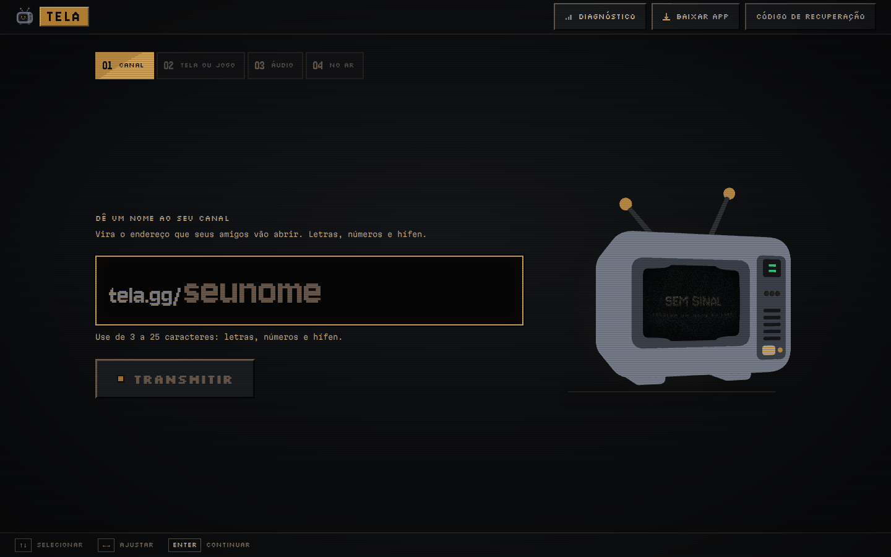
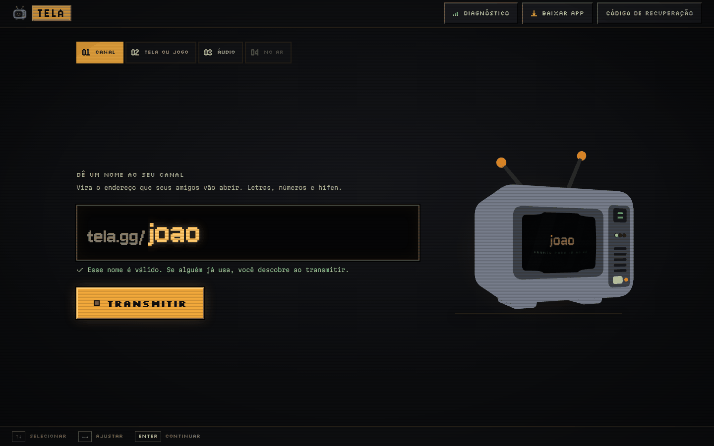

| ID | Sev | Problema | Heurística | Proposta | Esf |
|---|:-:|---|---|---|:-:|
| H-01 | 1 | A abertura é 1,8 s em toda visita, inclusive de quem só abre a home para voltar a transmitir. Não é bloqueante (pula com qualquer entrada), então o custo real é baixo. | H7 flexibilidade | Manter (decisão do ADR 0013). Se houver dado de abandono: pular quando a última visita foi há menos de 10 min (`localStorage`). | XS |
| H-02 | 2 | Na primeira visita, "TRANSMITIR" nasce `disabled` com `faint` sobre `key` (2,33:1) e a única explicação é a frase cinza abaixo do campo. Quem tecla Enter com o campo vazio não recebe resposta. | H1 status, H5 prevenção | Deixar o botão habilitado; com o campo vazio ou inválido, o clique foca `#slug` e troca a frase para `! Digite um nome para o canal.` Mantém o `aria-describedby` já existente. | S |
| H-03 | 2 | Retorno: o campo vem preenchido ("joao"), com "Esse nome é válido. Se alguém já usa, você descobre ao transmitir." Nada diz que é o último nome usado. | H6 reconhecimento | Rótulo acima do campo, só quando veio do `localStorage`: `ÚLTIMO CANAL · TROQUE SE QUISER`. | XS |

### 3.2 Passo 1: nome do canal

Estados capturados: vazio (`03-passo1-vazio-d.png`, `-m.png`), foco (`03-passo1-foco-campo-d.png`), válido (`03-passo1-valido-m.png`), inválido (`03-passo1-invalido-d.png`, `-m.png`), nome em uso (`06b-slug-ocupado-d.png`, descrito em B-02).

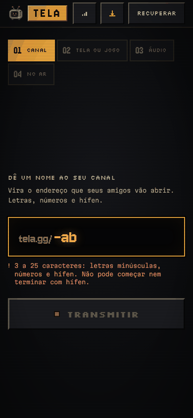

| ID | Sev | Problema | Heurística | Proposta | Esf |
|---|:-:|---|---|---|:-:|
| B-04 | 2 | `-ab` e `ab` recebem a mesma frase longa ("3 a 25 caracteres: letras minúsculas, números e hífen. Não pode começar nem terminar com hífen."): a pessoa tem de descobrir qual das quatro regras quebrou. Além disso, no foco a borda vermelha de inválido é sobrescrita pelo `focus-within:border-accent`: na captura mobile o campo inválido está âmbar, e só o texto e o "!" sinalizam. | H9 erros, H1 | Uma frase por regra: `! Falta pelo menos 1 caractere (mínimo 3).` · `! Não pode começar com hífen.` · `! Não pode terminar com hífen.` · `! Só letras, números e hífen.` Borda: `invalid:` vence `focus-within:` (foco vira o anel externo `outline`, não a borda). | S |
| B-12 | 1 | O aviso verde "Se alguém já usa, você descobre ao transmitir." é honesto, mas posterga o pior erro para o passo 4 (ver B-02). | H5 prevenção | Texto: `Nome válido. Se outra pessoa estiver no ar com ele, você saberá ao ir ao ar.` (curto e explica "quando"). | XS |

### 3.3 Passos 2 e 3: imagem e áudio

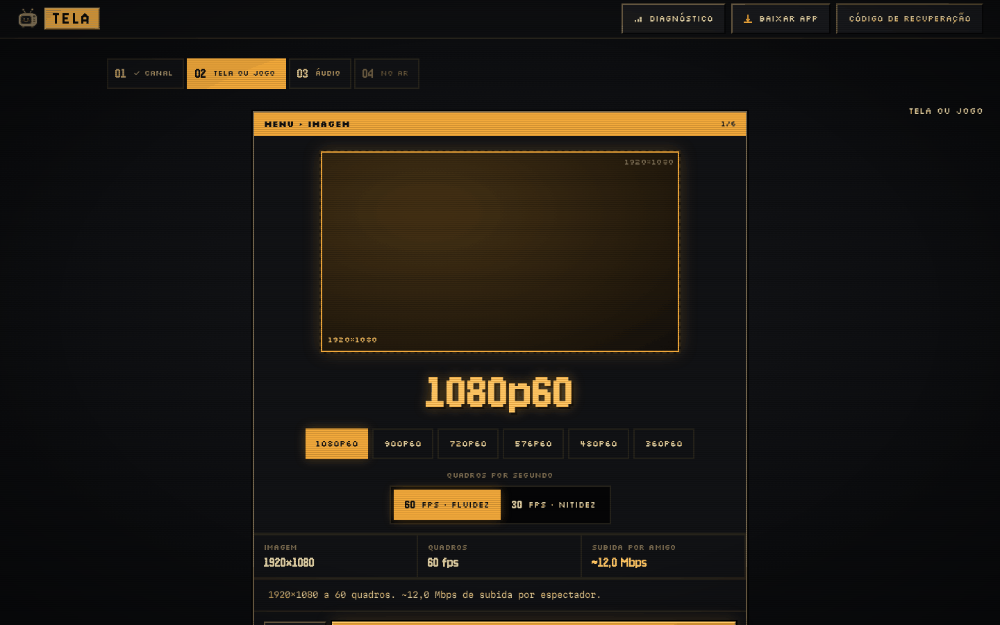
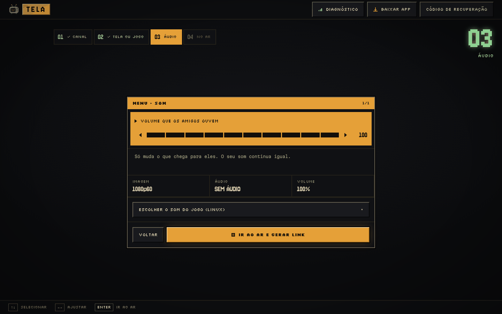

| ID | Sev | Problema | Heurística / princípio | Proposta | Esf |
|---|:-:|---|---|---|:-:|
| **B-01** | **3** | "CONTINUAR ▸ ÁUDIO" fica em `top=895, bottom=939` em 1440×900, 1366×768 e 1280×720 (a prévia 16:9 de "1920×1080" ocupa ~290 px e é decorativa). No celular, 879 a 923 de 844. A ação primária do passo está fora da tela em todos os tamanhos medidos. O rodapé "ENTER CONTINUAR" ajuda, mas só existe de `md` para cima e só para quem sabe que a janela tem foco. | Lei de Fitts (alvo distante, fora da tela), H7 | Prévia com `max-height: 24dvh`; o `RodapeDoPasso` passa a `position: sticky; bottom: 0` com fundo `surface`. Resultado esperado: CONTINUAR sempre visível. | S |
| B-08 | 2 | O nome do passo ("02 TELA OU JOGO") não corresponde ao conteúdo ("MENU ▸ IMAGEM": resolução e fps). A escolha da tela acontece no seletor do navegador, depois de "IR AO AR". "03 ÁUDIO" só tem "VOLUME QUE OS AMIGOS OUVEM"; a decisão que importa (marcar "compartilhar áudio do sistema" no seletor) não é dita antes. No Linux o resumo mostra "ÁUDIO: SEM ÁUDIO" e a explicação está num acordeão "ESCOLHER O SOM DO JOGO (LINUX)". | H2 correspondência com o mundo real, H6 | Renomear: `02 IMAGEM`, `03 SOM`. Acima de "IR AO AR": faixa fixa `NA PRÓXIMA JANELA: escolha a tela ou o jogo e marque "Compartilhar áudio do sistema".` (texto ajustável por navegador/SO via `platform`). | S |
| B-09 | 2 | Os controles "QUADROS" (FLUIDEZ/NITIDEZ) e, no console, "SE A REDE APERTAR" não são parada de Tab: a ordem medida vai de "Resolução" direto para VOLTAR. Alcança-se com ↑↓ dentro do menu OSD, e a legenda de teclas só aparece em `md+`. Em leitor de tela, ↑↓ pode estar em modo de navegação. | WCAG 2.1.1, H7 | Cada linha do menu OSD é uma parada de Tab (`tabindex=0` na linha ativa e `-1` nas demais não basta: o grupo precisa de uma parada por linha) ou manter o modelo e anunciá-lo: `aria-describedby` com "Use as setas para cima e para baixo para trocar de linha". | M |
| B-10 | 1 | Passo 3 com volume em 100% mostra "100" na barra e "100%" no resumo: dois números iguais para o mesmo dado. | H8 minimalismo | Remover o numeral da barra; manter no resumo. | XS |

**Carga cognitiva (Hick).** Em cada passo há poucas escolhas (6 resoluções e 2 modos em um grupo; 1 slider no passo 3), o que é bom. O custo está no número de telas, não de opções: para quem volta, o caminho é Enter, Enter/clique, clique em "IR AO AR", mais o seletor do navegador. Ver B-05.

**O atalho "TRANSMITIR AGORA" não existe mais.** O comentário em `Home.tsx` registra que o atalho direto ao ar do passo 1 "saiu a pedido do dono do produto: o fluxo passa pelos três". A trilha tem 02 e 03 como botões saltáveis, mas não o 04; portanto não há como ir do passo 1 ao ar de uma vez. Pelo AGENTS.md ("em conflito, os documentos vencem") isto fica como argumento, não como mudança:

> **B-05 (sev 2, H7).** Argumento: quem volta repete a mesma sequência de 3 interações a cada sessão (a pessoa já escolheu imagem e som na vez anterior; a preferência de preset já é gravada). Proposta que respeita a decisão original, porque nenhuma escolha fica oculta: no passo 1, quando existe slug salvo **e** preset salvo, mostrar abaixo de TRANSMITIR um botão secundário `IR AO AR · 1080p60 · SISTEMA` que mostra no próprio rótulo o que será enviado. Sem esse resumo no rótulo, o atalho volta a ser a decisão às cegas que o dono rejeitou. Esforço M. Precisa de aprovação do dono.

### 3.4 "IR AO AR" e erros de captura (R4)

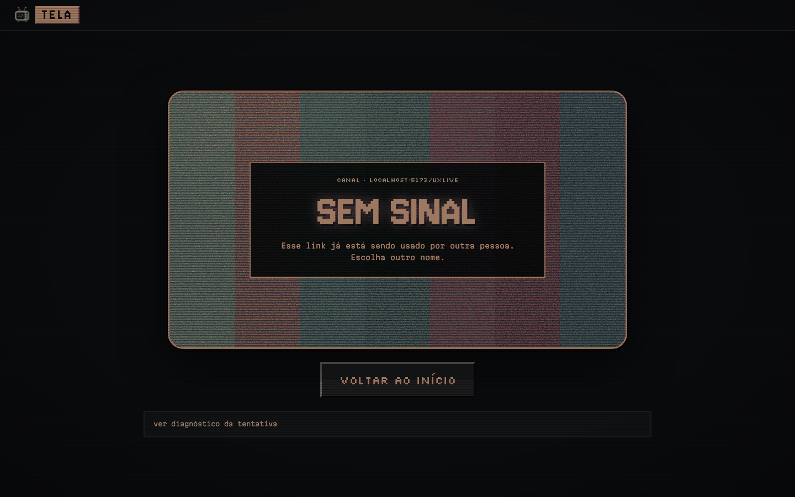

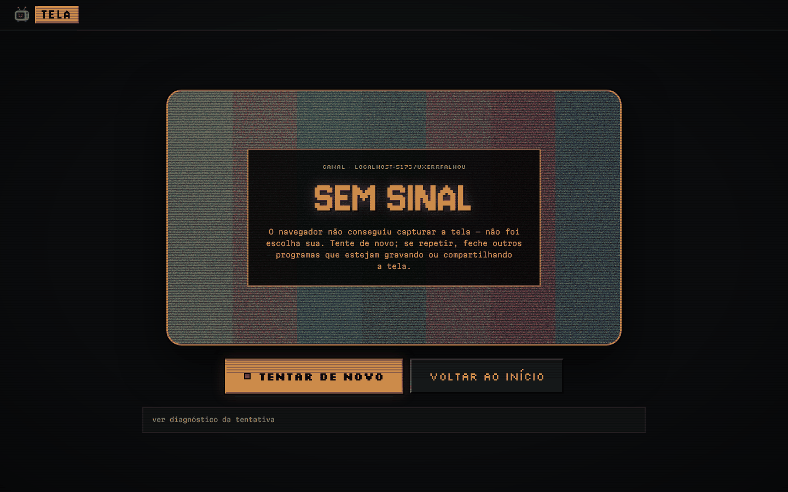

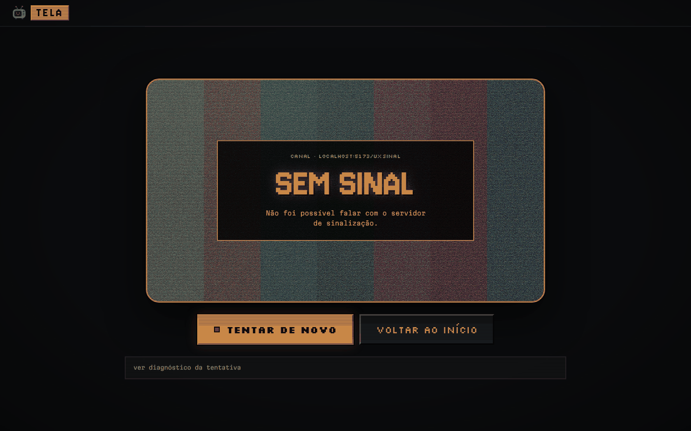

Textos de `MOTIVOS` (`Broadcast.tsx`), exibidos pela tela "SEM SINAL": negada ("Você cancelou o compartilhamento de tela, ou o navegador não tem permissão para capturá-la."), falhou ("O navegador não conseguiu capturar a tela — não foi escolha sua…"), sem API, nome em uso, sinalização fora. A separação R4 entre `DENIED` e `FAILED` está certa nos **textos**.

| ID | Sev | Problema | Heurística | Proposta | Esf |
|---|:-:|---|---|---|:-:|
| **B-02** | **3** | **Nome em uso** só aparece depois de "IR AO AR" e do seletor de tela, com o título "SEM SINAL", barras de teste vermelhas e os botões "TENTAR DE NOVO" e "VOLTAR AO INÍCIO". "Tentar de novo" não resolve (o nome continua ocupado) e a pessoa perde o contexto: volta ao passo 1 sem saber o que mudar. | H9 recuperação de erro, H5 | Título `NOME EM USO`. Corpo: `Outra pessoa está no ar em tela.gg/joao. Escolha outro nome.` Botão primário `ESCOLHER OUTRO NOME` (vai ao passo 1, campo focado e selecionado) e chips com sugestões locais (`joao-2`, `joao-tv`). Sem "tentar de novo" neste motivo. Não propõe sondagem de slug no servidor: o ADR 0026/Home descreve que isso foi evitado de propósito (enumeração). | S |
| **B-03** | **3** | O mesmo título "SEM SINAL" e o mesmo quadro vermelho cobrem seis situações diferentes: nome em uso, cancelou, falha de captura, navegador sem captura, servidor fora, e a queda do transporte. "SEM SINAL" é vocabulário de espectador (não chega vídeo); aqui quem transmite está num estado que não é "sinal". Em especial, **cancelar o seletor é uma escolha da pessoa**, e a tela a trata como falha em vermelho. | H2 correspondência, H9, consistência | Mapa `título` por motivo (mesmo `Record<BroadcastFailure, …>`, mantém a exaustividade R4): `CAPTURA_CANCELADA` → `COMPARTILHAMENTO CANCELADO`, moldura âmbar (não vermelha), botão `ESCOLHER A TELA DE NOVO`. `CAPTURE_FAILED` → `NÃO FOI POSSÍVEL CAPTURAR A TELA`. `CAPTURE_UNSUPPORTED` → `ESTE NAVEGADOR NÃO CAPTURA A TELA` (sem "tentar de novo"). `SIGNALING_UNAVAILABLE` → `SEM CONEXÃO COM O TELA`. `TRANSPORT_FAILED` → `A TRANSMISSÃO CAIU`. Reservar "SEM SINAL" ao espectador. | S |
| B-11 | 1 | "ver diagnóstico da tentativa" aparece em todos os motivos, inclusive em cancelamento deliberado e no encerramento normal (`17-fim-transmissao-2-d.png`). É ruído onde não há diagnóstico a fazer. | H8 | Mostrar só em `SIGNALING_UNAVAILABLE`, `TRANSPORT_FAILED`, `CAPTURE_FAILED`. | XS |
| B-06 | 2 | Quem abre em celular percorre os 3 passos e só descobre que não dá para transmitir ao final ("Este navegador não permite capturar a tela. Use Chrome ou Firefox no desktop."). Captura: `20-erro-captura-sem-api-d.png`. | H5 prevenção | Na home, se `!navigator.mediaDevices?.getDisplayMedia`: no lugar do campo, `Para transmitir, abra o Tela num computador (Chrome ou Firefox). Para assistir, abra o link que seu amigo mandou.` | S |

### 3.5 Console ao vivo (rota `/transmitir`)

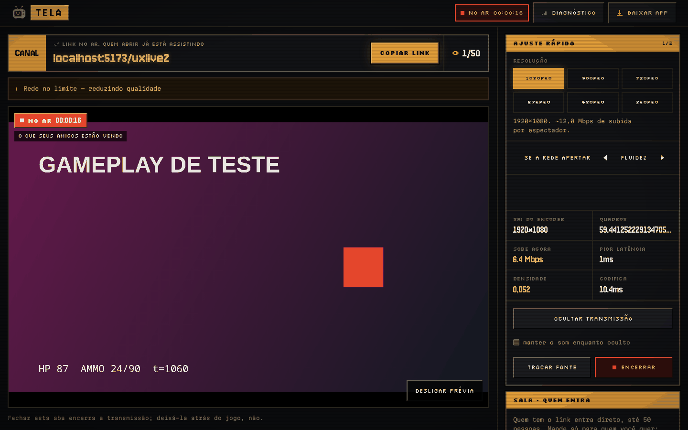
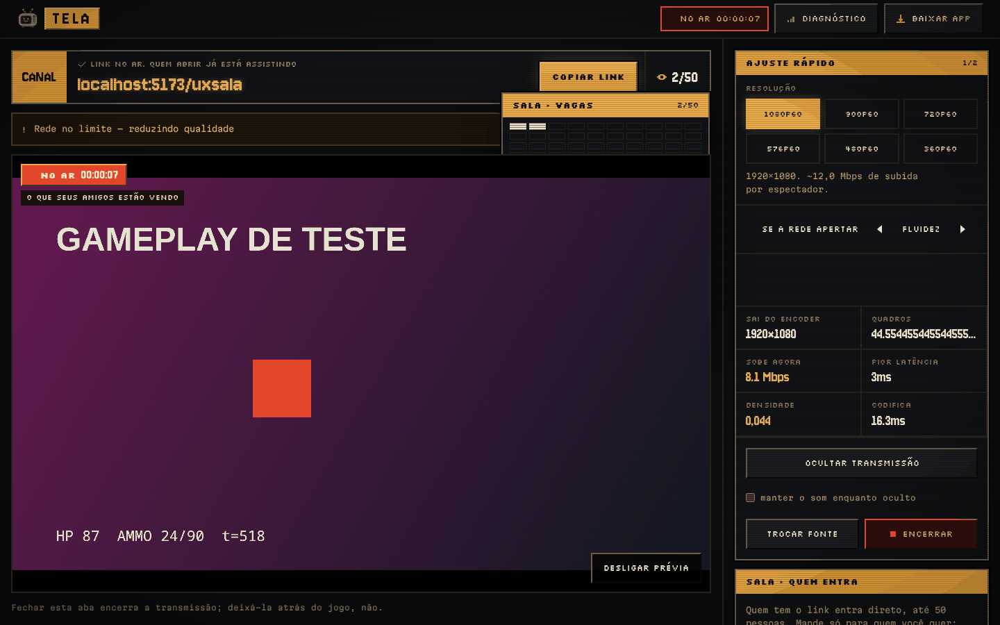
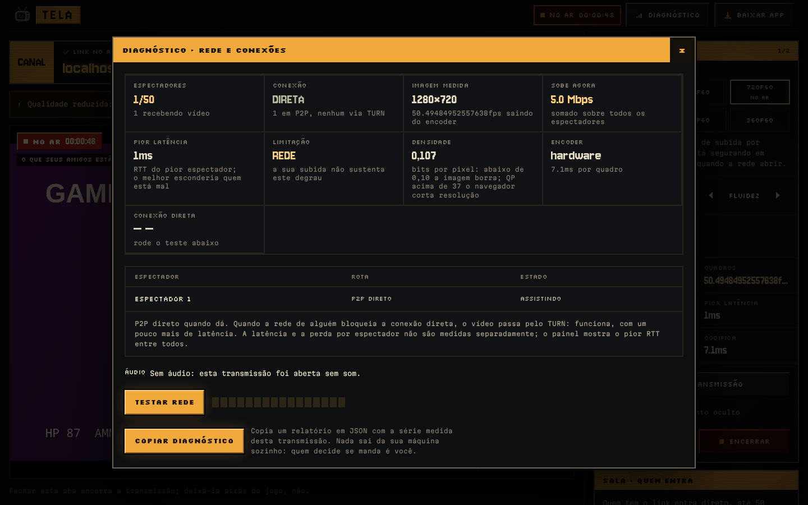
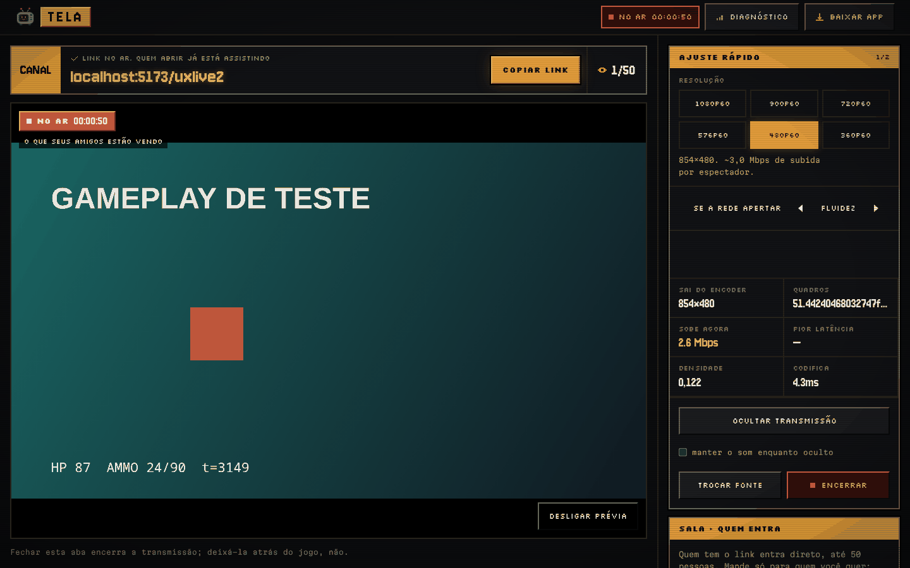
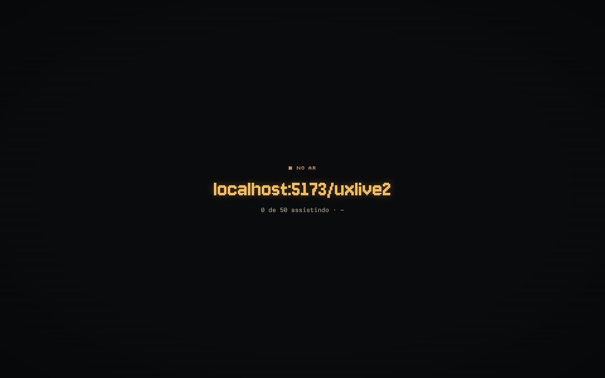

Tela de fim: `capturas/17-fim-transmissao-2-d.png`.

| ID | Sev | Problema | Heurística | Proposta | Esf |
|---|:-:|---|---|---|:-:|
| **C-01** | **3** | O popover "SALA ▸ VAGAS" (aberto pelo `<summary>` "Sala: 2 de 50 vagas ocupadas") renderiza **por trás** do bloco da prévia: a lista de espectadores fica cortada na altura do vídeo (captura 11). O texto está no DOM (`ESPECTADOR 1 ASSISTINDO`), mas ninguém o vê. Esc fecha. | H1, H4 consistência | Atributo `popover` (top layer) ou `<dialog>` não modal; alternativa de uma linha: `z-index` do popover acima do `z-41` do `.acima-do-crt` do vídeo. | S |
| C-02 | 2 | "QUADROS" exibe `59.441252229134705fps`, `51.44240468032747f…` (truncado com reticências) e, no diagnóstico, `50.49484952557638fps saindo do encoder`. Também no texto lido pelo leitor de tela. | H8, H2 | `Math.round` e unidade com espaço: `59 fps`. | XS |
| **C-03** | **3** | ENCERRAR: com espectador no ar usa `window.confirm("2 pessoa(s) assistindo. Encerrar mesmo assim?")` (medido): diálogo nativo, sem a identidade do Tela, com "pessoa(s)", e em Chrome o Enter confirma. Sem espectador, um clique encerra sem confirmação. ENCERRAR (163×44) fica a ~8 px de TROCAR FONTE (163×44), no canto inferior da coluna: bom para Fitts de quem quer encerrar, ruim para o erro de quem queria trocar a fonte. | H5, Fitts (vizinhança) | `Dialogo` do Tela: título `ENCERRAR A TRANSMISSÃO?`, corpo `2 amigos estão assistindo agora e vão perder a imagem.` (singular/plural certo), botões `CONTINUAR NO AR` (foco inicial, primário) e `ENCERRAR` (perigo). Sem espectador: encerra direto, mas com a tela de fim já oferecendo `TRANSMITIR DE NOVO`. Afastar TROCAR FONTE de ENCERRAR (ENCERRAR sozinho na última linha, largura total). | S |
| C-04 | 2 | Plaqueta: com 0 espectadores e o ponteiro parado por ~5 s o console vira uma plaqueta (link em numeral grande, "0 de 50 assistindo · —"). É a decisão de design (quem captura a tela inteira manda o console aos amigos). Mas: o link da plaqueta não é copiável; os controles escondidos continuam no DOM e na ordem de Tab (foco invisível); nada diz como voltar. | H1, H3 controle | Dica de 11 px `MOVA O MOUSE PARA ABRIR O CONSOLE`; foco em qualquer controle escondido também acorda o console (como já faz a barra do espectador com `focusin`). | S |
| C-05 | 2 | Diagnóstico em jargão: "DENSIDADE 0,107 bits por pixel… QP", "LIMITAÇÃO REDE", "P2P", "TURN", "ENCODER hardware 7.1ms por quadro". Correto, útil para você, opaco para quem só quer saber se os amigos veem bem. As seis células da coluna direita ficam `—` até o primeiro espectador. | H2, H8 | Linha de veredito no topo, com LED: `TUDO CERTO · 1 amigo recebendo 1280×720 a 50 fps · conexão direta` (ou `! SUA SUBIDA NÃO SUSTENTA 1080p60 · enviando 720p60`). A grade atual vai para `VER DETALHES`. Antes do primeiro espectador: uma linha `Aguardando o primeiro amigo`, sem seis traços. | M |
| C-06 | 1 | Degradação: o banner "! Rede no limite — reduzindo qualidade" é bom (H1), mas não diz **para o quê** nem **quem** causou; a resposta está no diagnóstico, duas camadas abaixo. Nesta captura headless a degradação disparou com 2 espectadores em localhost; num link real a decisão é do governador (não avaliada aqui). | H1 | `! Seu upload não sustenta 1080p60: enviando 720p60. Volta sozinho quando a rede sobrar.` (o texto do `role="status"` já existente no diagnóstico serve de base). | XS |
| C-07 | 1 | Checkbox "manter o som enquanto oculto": o controle visível mede 13×13 px (a etiqueta amplia a área de clique, não verificado). Rótulo "OCULTAR TRANSMISSÃO" é ambíguo: oculta o quê, de quem? | WCAG 2.5.8, H2 | Alvo de 24 px no mínimo (`min-h-6 min-w-6` no `input`); rótulo `OCULTAR O CONSOLE` ou `ESCONDER ESTA PÁGINA`. | XS |
| C-08 | 1 | Sala: espectadores listados como "ESPECTADOR 1/2" (sem nome, por desenho: sem contas, R6). Para remover alguém só há "DESCONECTAR TODOS". | H3 controle | Fora de escopo para identidade. Possível dentro do R6: remover um a um (o protocolo já aceita `remove-viewers` com `peerId`), com o rótulo `ESPECTADOR 2 · entrou há 4 min`. | M |

### 3.6 Espectador

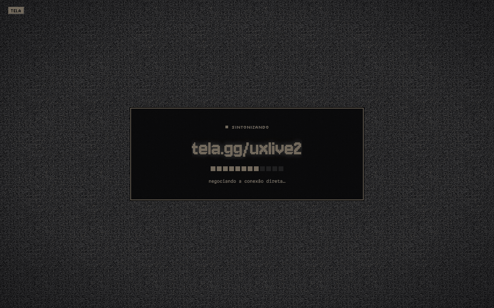
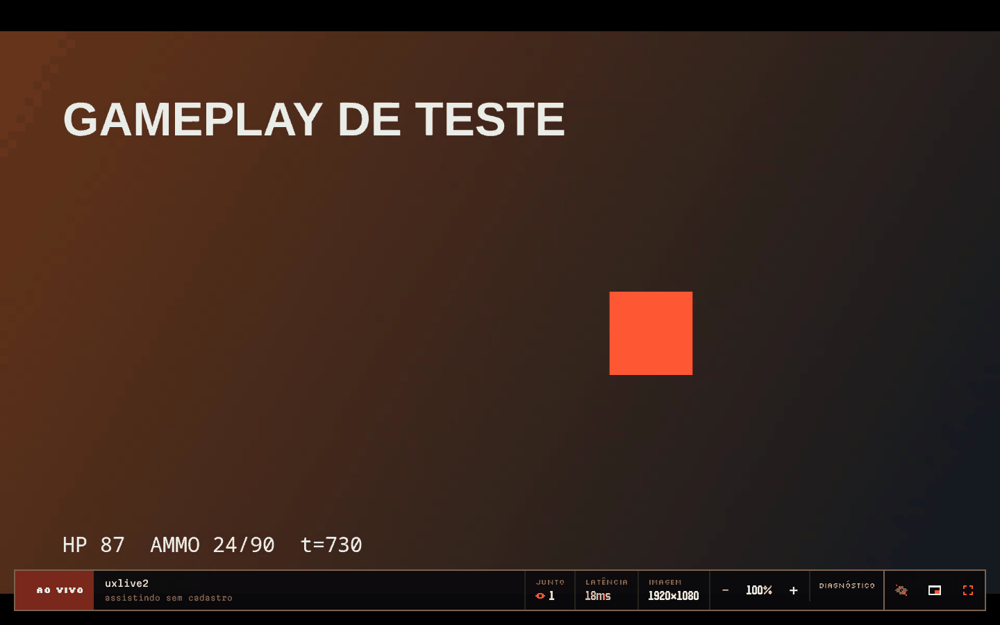
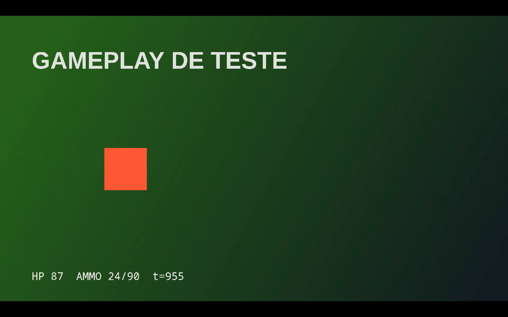
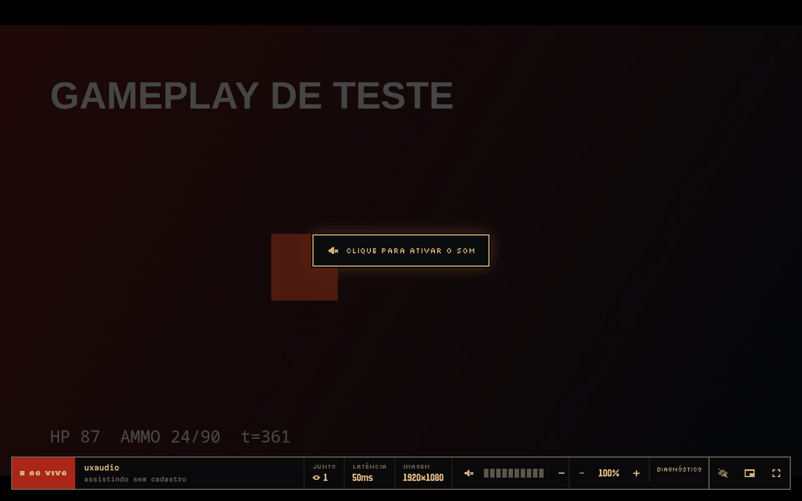
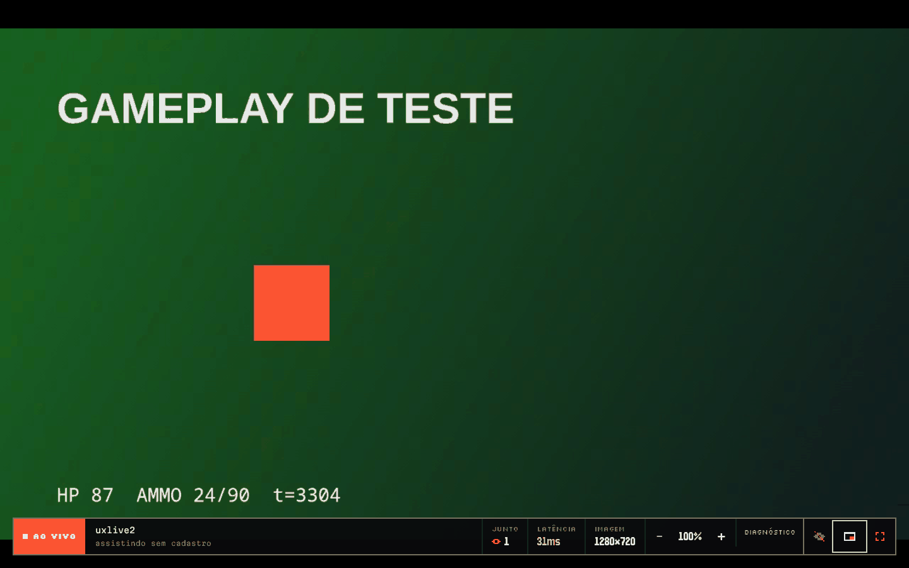
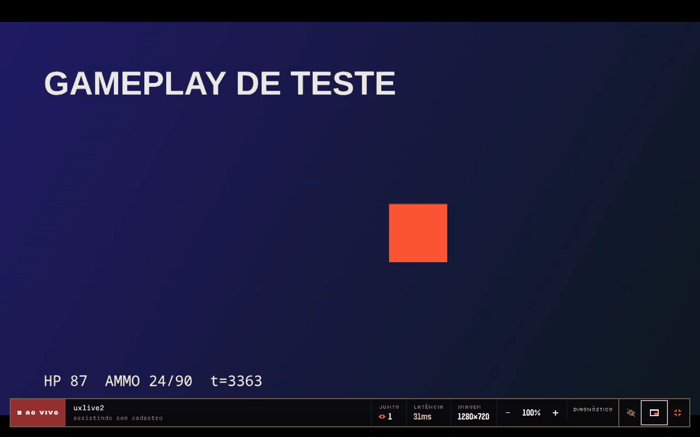

Estados de espera e erro: aguardando sinal (`22-viewer-offline-d.png`, `22-viewer-offline-m.png`), sem vaga (`23-viewer-sem-vaga-d.png`), sem servidor (`24-viewer-sem-servidor-d.png`), depois do fim (`18-viewer-apos-fim-d.png`). "Sem vaga" e "sem servidor" foram forçados com `routeWebSocket` (`CHANNEL_FULL` com `maxPeers: 5`, e socket fechado).

**Tempo até o primeiro quadro** (cinco medições de `goto` até `video.videoWidth > 0 && readyState >= 2`, host e espectador em `localhost`, Chromium headless): 1395 ms (primeira, com carga fria), depois 914, 843, 849 e 849 ms. Em rede real vai depender de ICE e de TURN: não medido.

| ID | Sev | Problema | Heurística | Proposta | Esf |
|---|:-:|---|---|---|:-:|
| **A-01** | **3** | **Espaço nos botões da barra não faz nada.** `useHotkeys` (`use-page-effects.ts`) só ignora `INPUT` e `contentEditable`, e chama `event.preventDefault()` em qualquer outro alvo; Espaço está mapeado para silenciar. Medido: foco em "Aumentar zoom (+)", Espaço mantém `100%`, Enter vai a `125%`. O mesmo para Tela cheia, PiP, Esconder, Copiar diagnóstico. As teclas de uma letra (`f`, `h`, `p`, `m`, `+`, `-`) também agem em qualquer foco. | WCAG 2.1.1 e 4.1.2 (A), 2.1.4 caracteres-atalho (A), H7 | Ignorar `BUTTON`, `A`, `[role=slider]`, `[role=radio]`, `SELECT`, `SUMMARY` e `TEXTAREA`; Espaço só mapeia quando o alvo é o palco (`main`) ou o `body`. Ao mesmo tempo, Espaço para silenciar não é padrão de player (em YouTube e Twitch é pausar): manter `m` para silenciar e tirar Espaço. Oferecer `?` com a lista de atalhos. | S |
| **V-01** | **3** | Celular na horizontal (844×390): a barra ocupa ~120 de 390 px (31%) em duas linhas e cobre o rodapé do jogo (`15-viewer-paisagem-m.png`). | H8, Fitts | Abaixo de 500 px de altura: uma linha de 44 px (`● AO VIVO · 2 · 68ms · volume · tela cheia`); zoom, PiP e diagnóstico atrás de `⋯`. Toque no vídeo alterna; sumir em 2 s. | M |
| V-02 | 2 | Celular em pé: três linhas (~180 px), com o bloco vermelho "AO VIVO" de 114×75 px. O vídeo 16:9 ocupa só o terço central; a barra e o vídeo disputam a pouca altura. | H8 | O mesmo modo compacto; no primeiro play em celular em pé, `GIRE O CELULAR OU TOQUE EM ⛶` por 3 s. | M |
| V-03 | 2 | Quando quem transmite encerra, o espectador cai em "AGUARDANDO SINAL — Deixe esta aba aberta" (`18-viewer-apos-fim-d.png`), o mesmo estado de "ainda não começou". Não dá para distinguir "acabou" de "ainda não é a hora". | H1 | Estado intermediário por 10 s: `A TRANSMISSÃO TERMINOU` com a hora, depois `aguardando sinal`. | S |
| V-04 | 2 | Quem espera (por horas, numa call do Discord) alterna de aba. O título só muda para `● slug · Tela` quando já está vendo; esperando, fica `slug · Tela`. | H1 | Esperando: título `◌ aguardando · slug`; ao entrar no ar: `● AO VIVO · slug` e troca do favicon. Opcional e desligado por padrão: bipe curto de 300 ms (WebAudio, sem permissão). Sem notificações do sistema na web (R6: não é rede social). | S |
| V-05 | 2 | "Sem servidor" abre com "No Brave, desligue os escudos…" para todo mundo. Quem tem a internet fora (o caso comum) lê conselho de navegador específico antes do óbvio. | H9 | `Sem conexão com o Tela. Verifique sua internet. Se usa Brave, desligue os escudos para este site; extensões de privacidade e proxy também bloqueiam.` Mais `Nova tentativa em 8 s` (contagem real). | S |
| V-06 | 1 | "assistindo sem cadastro" na barra é vocabulário de posicionamento do produto, não informação para quem assiste. | H2 | `{N} assistindo` ou o nome do canal apenas. | XS |
| V-07 | 1 | O ícone de "Esconder controles (H)" em 18 px (olho riscado) lê como borrão (`09-viewer-ao-vivo-barra-d.png`, canto direito). | H4 | Ícone de 20 a 22 px com traço de 2 px ou o texto `OCULTAR`. | XS |
| V-08 | 1 | O botão de som duplicado no leitor de tela: "Ativar o som" aparece duas vezes (overlay e barra), a segunda com `aria-pressed` e rótulo trocando: dupla negação. O slider mede "1" em vez de "100%". | WCAG 4.1.2 | `aria-pressed` fixo com rótulo fixo "Silenciar", ou rótulo variável sem `aria-pressed`; `aria-valuetext="100%"`. | XS |
| V-09 | 1 | O overlay "CLIQUE PARA ATIVAR O SOM" escurece o jogo para ~25% (`28-viewer-audio-bloqueado-d.png`). Claro como affordance, pesado como estado. | H8 | 55% de escurecimento; ou chip no canto em vez de cobrir. | XS |
| V-10 | 1 | "Sem vaga · 5/5" usa o LED verde, a mesma cor de "tudo certo". O texto está certo ("Você entra sozinho quando alguém sair"). | H4 | LED âmbar (espera), e `tentando a cada 5 s` para a pessoa saber que há vida. | XS |

### 3.7 `/recuperar` e 404

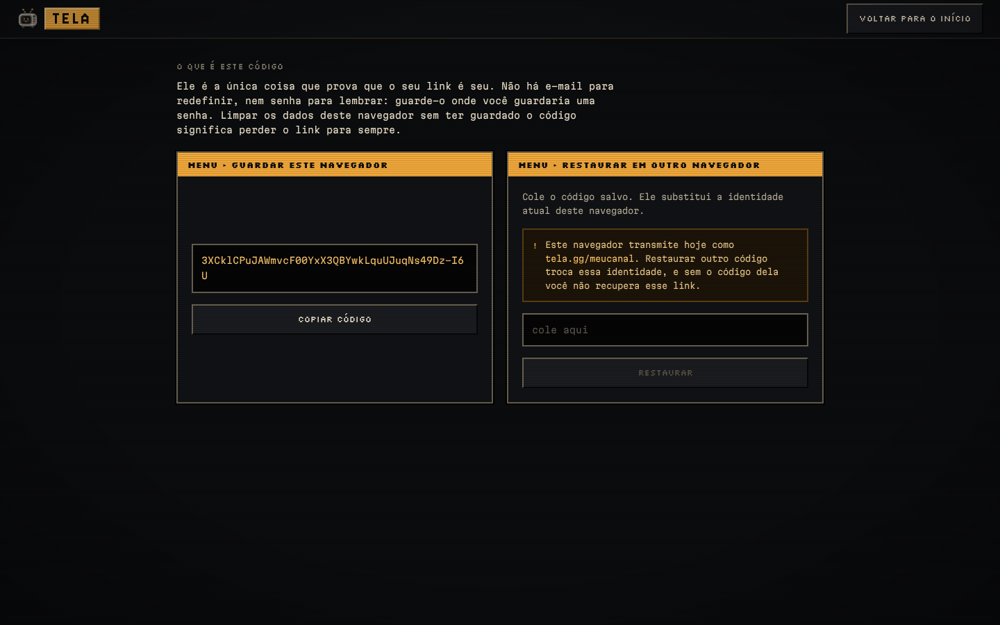
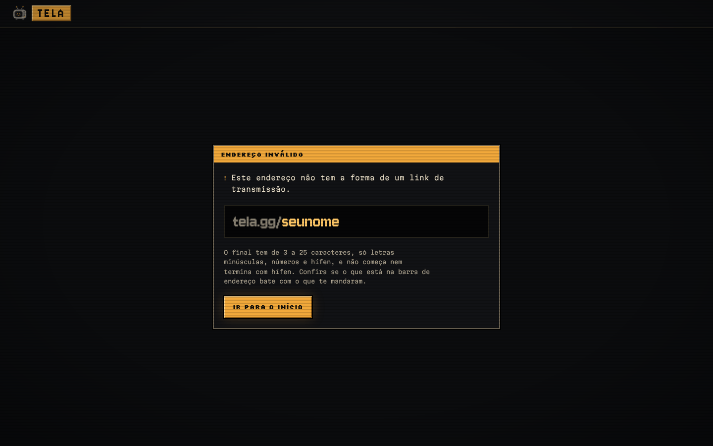

| ID | Sev | Problema | Heurística | Proposta | Esf |
|---|:-:|---|---|---|:-:|
| **R-01** | **3** | O código (que é a prova de propriedade do canal) aparece em texto claro por padrão numa página que o usuário abre **justamente quando vai transmitir a tela inteira**. RESTAURAR é destrutivo (troca a identidade do navegador) e executa direto: o aviso amarelo avisa, mas não pede confirmação. Depois: "Pronto. Volte e digite o slug do link para transmitir." Não leva a lugar nenhum e o código não carrega o nome do canal. | H5, H3, segurança | Mascarar `••••••••••••• U` com `MOSTRAR (10 s)` e `COPIAR CÓDIGO` funcionando sem revelar. Aviso fixo: `Não deixe esta tela aberta durante uma transmissão de tela inteira.` RESTAURAR abre `Dialogo`: `Isto troca o canal deste navegador (tela.gg/meucanal). Sem o código dele, esse link não volta.` `CANCELAR` (foco) / `TROCAR O CANAL`. Depois: `Código restaurado.` e botão `IR PARA A HOME` (com o último slug conhecido do código, se o formato do código passar a incluí-lo). | M |
| R-02 | 1 | Nome da função fragmentado: "CÓDIGO DE RECUPERAÇÃO" (cabeçalho), "RECUPERAR" (≤ 360 px), "O QUE É ESTE CÓDIGO", "GUARDAR ESTE NAVEGADOR", "RESTAURAR EM OUTRO NAVEGADOR" e, no desktop, "CANAL". | Consistência (H4) | Um nome só: `CÓDIGO DO CANAL`. | XS |
| R-03 | 2 | 404: a explicação ("Este endereço não tem a forma de um link de transmissão…") é boa, mas fala em "forma" e regras de caracteres antes do que fazer. | H9 | Primeiro a ação: `Confira o endereço que te mandaram.` `IR PARA O INÍCIO`. Regras do slug em segundo plano. | XS |

### 3.8 Modais da home

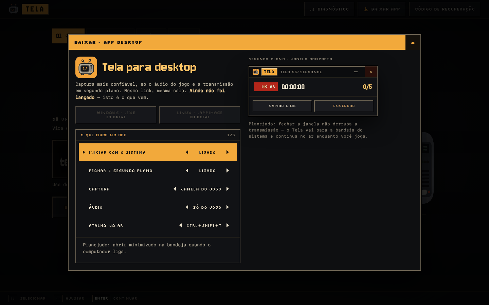
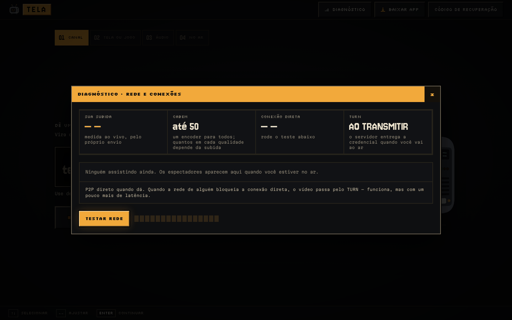

| ID | Sev | Problema | Heurística | Proposta | Esf |
|---|:-:|---|---|---|:-:|
| B-07 | 2 | "BAIXAR APP" é o segundo botão do cabeçalho em todas as páginas. Abre "Ainda não foi lançado — isto é o que vem" e os dois botões de download estão desabilitados ("EM BREVE"). Beco sem saída com cara de ação primária; é também o botão que cobre a posição que "ASSISTIR" e "Abrir no app" ocuparão. | H1, H5 | Esconder até haver binário (`ofereceApp` já existe como chave). Se ficar, rótulo `APP DESKTOP · EM BREVE`, fora do cabeçalho. | S |
| W-04 | 2 | Em 320 px a barra do cabeçalho transborda: `scrollWidth = 355 > 320` (WCAG 1.4.10), "RECUPERAR" sai cortado (`30-home-320-m.png`). O `body` tem `overflow-x: hidden`, que esconde o erro em vez de evitá-lo. | WCAG 1.4.10 | Abaixo de 360 px os botões do cabeçalho viram só ícone (já existem `IconTv`/ícones) com `aria-label`; `flex-wrap`. | S |

---

## 4. Acessibilidade (WCAG 2.2 AA)

### 4.1 Contraste, calculado a partir dos tokens de `globals.css`

Luminância relativa WCAG 2.x. Os valores coincidem com a tabela do próprio CSS, o que valida o cálculo.

| Par (texto/fundo) | Cores | Razão | Uso | AA |
|---|---|:-:|---|:-:|
| `text` / `void` | #ece3cf / #0b0c0e | 15,33 | corpo | passa |
| `muted` / `void` | #b5ab96 / #0b0c0e | 8,60 | secundário | passa |
| `accent` / `void` | #f2a93b / #0b0c0e | 9,80 | ação, seleção | passa |
| `accent-hi` / `deep` | #ffc766 / #050506 | 13,21 | numerais e slug | passa |
| `ink` / `accent` | #14100a / #f2a93b | 9,49 | botão primário | passa |
| `dim` / `void` | #8a8272 / #0b0c0e | 5,14 | rótulos 11 px | passa |
| `dim` / `surface` | #8a8272 / #111215 | 4,92 | rótulos em painel | passa |
| `dim` / `key` | #8a8272 / #1b1c20 | **4,47** | rótulo sobre tecla | **falha por 0,03** |
| `danger` / `void` | #ff8a76 / #0b0c0e | 8,53 | erro | passa |
| `live-hi` / `bar` | #ff6a52 / #0e0f11 | 6,79 | LED, "NO AR" | passa |
| branco / `live` | #fff / #b3261a | 6,54 | selo AO VIVO | passa |
| `ok` / `void` | #8fd694 / #0b0c0e | 11,38 | confirmado | passa |
| `faint` / `void` | #5c5648 / #0b0c0e | **2,68** | "04 NO AR", passos bloqueados | **falha** (exceção só para desabilitado) |
| `faint` / `key` | #5c5648 / #1b1c20 | **2,33** | TRANSMITIR desabilitado | exceção de desabilitado |
| `edge` / `void` | #6b6252 / #0b0c0e | 3,26 | contorno de controle | passa (1.4.11, 3:1) |
| `edge` / `key` | #6b6252 / #1b1c20 | **2,83** | contorno sobre tecla | **falha** 1.4.11 |
| `line` / `void` | #26231b / #0b0c0e | 1,25 | divisor decorativo | n/a |
| anel de foco `accent-hi` / `deep` | #ffc766 / #050506 | 13,21 | todos os controles | passa (2.4.7) |

**Efeito da camada CRT.** `.crt-vidro` (z 40) fica sobre o texto da interface: scanlines de 16% de preto em 1 de cada 3 pixels e vinheta de até 32% nas bordas. Modelando o pior caso (glifo sob a linha da scanline, fundo entre linhas): `dim` sobre `void` cai de 5,14 para **3,82**, `dim` sobre `bar` (rodapé "↑↓ SELECIONAR…") para **3,74**, `edge` para **2,54**; `muted` fica em 6,17 (ok). É o texto de 11 px em Silkscreen, o mais frágil, que mora no `dim`. `prefers-contrast: more` já desliga a camada (bom). Não foi medido em pixel real.

| ID | Sev | Problema | Proposta | Esf |
|---|:-:|---|---|:-:|
| W-01 | 2 | `dim` abaixo de 4,5:1 sobre `key`, e ~3,8:1 sob scanline no pior caso, em rótulos de 11 px. | `--color-dim: #9a927f` (6,33:1; pior caso sob scanline 4,64:1); ou scanline em 10%, que dá 4,28 (insuficiente sozinho). | XS |
| W-02 | 2 | "04 NO AR" e os passos bloqueados usam `faint` (2,68:1). "04 NO AR" não está desabilitado: é o destino do assistente e informação. | `muted` para o 04; `faint` fica só para o desabilitado de verdade. | XS |
| W-03 | 1 | Contorno `edge` sobre `key` (2,83:1) nas opções não selecionadas de resolução e quadros: a forma do controle depende do texto. | Contorno `#7d7360` (≥ 3:1 sobre `key`). | XS |

### 4.2 Teclado: mapa de foco registrado com Tab

Ordem real, medida com `Tab` no Chromium (alvo × tamanho). `body` indica que o foco saiu do documento.

**Home, passo 1** (campo vazio)
`TELA` (120×44) → `DIAGNÓSTICO` (150×44) → `BAIXAR APP` (143×44) → `CÓDIGO DE RECUPERAÇÃO` (212×44) → campo `#slug` (526×77, sem `outline`, foco por borda `accent`) → `body`. TRANSMITIR é pulado enquanto `disabled`. Com o slug válido a trilha entra na ordem do DOM: `02 TELA OU JOGO` → `03 ÁUDIO` → campo → `TRANSMITIR`.

**Passo 2:** `TELA` → `DIAGNÓSTICO` → `BAIXAR APP` → `CÓDIGO…` → `01 ✓ CANAL` (111×44) → `03 ÁUDIO` (90×44) → grupo `Resolução` (uma parada, ←→ troca) → `VOLTAR` (90×44) → `CONTINUAR ▸ ÁUDIO` (582×44). Falta: `QUADROS POR SEGUNDO` não é parada (B-09).

**Passo 3:** o `slider` de volume, `ESCOLHER O SOM DO JOGO (LINUX)` (acordeão), `VOLTAR`, `IR AO AR E GERAR LINK`.

**Console ao vivo:** `DIAGNÓSTICO` → `BAIXAR APP` → `COPIAR LINK` (141×44) → `Sala: n de 50 vagas…` (`summary`, 92×44) → `DESLIGAR PRÉVIA` (159×44) → `Resolução` (334×94) → `OCULTAR TRANSMISSÃO` (334×44) → checkbox (**13×13**) → `TROCAR FONTE` (163×44) → `ENCERRAR` (163×44) → `DESCONECTAR TODOS` (184×44) → `body`. "SE A REDE APERTAR" não é parada.

**Espectador (sem áudio):** `Diminuir zoom (−)` (44×44) → `Zoom 100%` (54×44) → `Aumentar zoom (+)` → `Copiar diagnóstico técnico…` (107×44) → `Esconder controles (H)` (48×44) → `Picture-in-picture (P)` → `Tela cheia (F)` → `body`.
**Com áudio:** `Silenciar` (44×44) → `Volume da transmissão` (slider 104×44) → o resto igual. A barra fica `opacity-0` mas focável, e `focusin` a traz de volta (correto, documentado no código).

**Atalhos do espectador:** `f` tela cheia · `h` esconder · `p` PiP · `+`/`=` e `-` zoom · `m` e **Espaço** silenciar · ↑/↓ volume. Duplo clique: tela cheia. Descoberta: só pelo `title`/`aria-label` de cada botão (sem lista de atalhos). Conflito: A-01.

| Critério | Resultado |
|---|---|
| 2.1.1 Teclado | **falha** no espectador (A-01); parcial no OSD (B-09) |
| 2.1.4 Atalhos de caractere único | **falha** (A-01): sem desligar nem remapear; agem com qualquer foco |
| 2.4.3 Ordem de foco | passa; no console, o foco entra em controles da plaqueta escondida (C-04) |
| 2.4.7 Foco visível | passa (anel de 2 px, 13,2:1); no campo do slug a indicação é a mudança de borda (3,26 para 9,80:1) |
| 2.4.11 Foco não obscurecido | passa nas telas medidas; a barra do espectador é focável quando escondida |
| 2.5.8 Tamanho do alvo (mínimo) | passa: nenhum alvo visível < 44×44 em home e `/recuperar` (varredura). Exceção: checkbox 13×13 no console (C-07) |
| 1.4.10 Reflow (320 px) | **falha** (W-04): `scrollWidth` 355 |
| 2.3.3 / 2.2.2 Movimento | `prefers-reduced-motion`: zero animações ativas (`document.getAnimations().length === 0`) e a abertura vira fade de 300 ms. Resta o LED pulsando 1 Hz (8×8 px) que, com movimento permitido, passa de 5 s sem mecanismo de pausa: baixo risco, o `prefers-reduced-motion` já o remove |
| 2.3.1 Flashes | o chiado animado (`chiado-anda`, 4 passos a cada 0,12 s) cobre a tela inteira só no estado "conectando"; é ruído de baixo contraste, mas vale validar com a ferramenta de flashes e manter `reduce` desligando |
| 4.1.2 Nome, função, valor | ver tabela abaixo |

### 4.3 Árvore de acessibilidade (`ariaSnapshot`)

| Tela | Estrutura | Problemas |
|---|---|---|
| Home | `banner` (link "Tela, ir para o início", botões), `main` com `status` "Passo n de 4: NOME", `navigation "Passos da transmissão"` (lista, `aria-current`), `region`, `heading` nível 1, `textbox "Nome do seu canal: o final do link"`, `status` com a regra, `contentinfo` | Bom. Passos 02 e 03 viram `button` só quando alcançáveis (o desabilitado não polui o Tab) |
| Console | `banner`, `main`, `complementary` com `region "AJUSTE RÁPIDO"` e `region "SALA ▸ QUEM ENTRA"` (cada uma com `heading` 2), `radiogroup "Resolução"`, `spinbutton "SE A REDE APERTAR"`, diálogo `"DIAGNÓSTICO ▸ REDE E CONEXÕES"` com `Fechar` | "QUADROS" lido com 15 casas decimais (C-02); `status` vazio (`paragraph` sem texto) na área de ajuste; `button "DESLIGAR PRÉVIA" [expanded]` usa `aria-expanded` para um interruptor (melhor `aria-pressed`) |
| Espectador | `main` único: texto "AO VIVO uxlive2 assistindo sem cadastro…" sem estrutura, grupo `Zoom`, botões com nome e atalho entre parênteses | `<video>` sem nome; sem `heading`; "Ativar o som" duplicado e `aria-pressed` + rótulo variável (V-08); slider sem `aria-valuetext` |
| Espera / erros | `status` (`aria-live="polite"`) com `h1` "tela.gg/slug" e o motivo | Bom. Em "sintonizando" o motivo vai em `sr-only`, bom |
| `/recuperar` | `h1`, `region`s com `h2`, `code`, `textbox` ligado ao `label` | Bom |

---

## 5. Heurísticas de Nielsen, em uma passada

| # | Heurística | Nota | Onde |
|---|---|:-:|---|
| H1 | Visibilidade do estado do sistema | 2 | Forte: sintonizando por etapa, "NO AR 00:00:16", banner de degradação. Fraco: espera sem aviso (V-04), fim silencioso (V-03), diagnóstico no fim da fila (C-05), TRANSMITIR desabilitado sem motivo (H-02) |
| H2 | Correspondência com o mundo real | 2 | "SEM SINAL" para tudo (B-03); passo "TELA OU JOGO" que não escolhe tela (B-08); "pessoa(s)" (C-03); jargão do diagnóstico (C-05) |
| H3 | Controle e liberdade | 2 | Cancelar o seletor vira "erro" (B-03); ENCERRAR sem desfazer (C-03); RESTAURAR direto (R-01) |
| H4 | Consistência e padrões | 2 | Espaço = silenciar (padrão é pausar) (A-01); "CANAL" × "CÓDIGO" (R-02, D-02); ícone "esconder" ilegível (V-07) |
| H5 | Prevenção de erros | 2 | Nome em uso só no fim (B-02); celular só descobre ao final (B-06); BAIXAR APP morto (B-07); ENCERRAR vizinho de TROCAR FONTE (C-03) |
| H6 | Reconhecimento em vez de memória | 3 | Boa: rótulos visíveis, legenda de teclas, resumo no passo 3 |
| H7 | Flexibilidade e eficiência | 2 | Sem caminho curto para quem volta (B-05); teclado quebrado (A-01); OSD por setas bom para quem sabe |
| H8 | Estética e design minimalista | 2 | A identidade é consistente; ruído: números crus (C-02), células "—" (C-05), "assistindo sem cadastro" (V-06) |
| H9 | Ajudar a reconhecer, diagnosticar e corrigir erros | 2 | Texto por causa (bom), mas ação errada para o motivo (B-02) e título genérico (B-03) |
| H10 | Ajuda e documentação | 3 | O produto quase não precisa; falta a lista de atalhos do espectador (A-01) |

Nota 3 = bom, 2 = com problemas de severidade 2 a 3, 1 = ruim.

---

## 6. Fitts, desempenho percebido, consistência

### 6.1 Lei de Fitts nas ações primárias

| Ação | Alvo (CSS px) | Posição em 1440×900 | Avaliação |
|---|---|---|---|
| TRANSMITIR (passo 1) | 257×64 | esquerda, abaixo do campo | Grande e próximo do campo. Bom |
| CONTINUAR (passo 2) | 582×44 | y=895 a 939: **fora da tela** (B-01) | Pior alvo do fluxo. O Enter compensa só para quem sabe |
| IR AO AR E GERAR LINK (passo 3) | 582×44 | y=651 a 695, visível | Largo. Bom |
| COPIAR LINK | 141×44 | canto superior direito da faixa, ao lado de `0/50` | Tamanho ok; fica longe de onde o olho está (o vídeo) mas é a primeira parada de Tab da página |
| ENCERRAR | 163×44 | canto inferior da coluna direita | Borda inferior/direita ajuda a acertar; a 8 px de TROCAR FONTE (C-03) |
| Barra do espectador | 44×44 cada | borda inferior | Ok no desktop; em celular, 180 px de barra (V-02) |

### 6.2 Desempenho percebido

- **Abertura:** 1,8 s, pulável por qualquer entrada, home já interativa em t=0 (campo visível em 84 ms medido). Custo percebido baixo; ver H-01.
- **CRT sobre o vídeo:** verificado. No espectador, `.crt-vidro` não é montado, não há `filter`, `backdrop-filter` nem `mix-blend-mode` em nenhum elemento, e a única animação em execução é o LED de 8 px. No console, a camada existe (z 40), mas `document.elementFromPoint` no centro da prévia retorna o `<video>`: o vídeo está acima da camada (z 41). Em ambos, só o LED pisca; com a aba oculta tudo pausa (`data-aba="oculta"`). A decisão "nada pesado em laço contínuo" do ADR 0022 se confirma.
- **Métricas do Chrome (CDP `Performance.getMetrics`, 5 s):** espectador ao vivo, `TaskDuration` 0,021 s por segundo (2% de uma thread), `ScriptDuration` 0,005, `LayoutCount` 1/s, `RecalcStyleCount` **33/s**. Console do transmissor com prévia: `TaskDuration` 0,070 s/s. As 33 recalculações de estilo por segundo no espectador, sem interação, não têm causa conhecida (o LED pisca a 1 Hz): vale uma olhada, severidade 1. `getVideoPlaybackQuality`: 155 de 2578 quadros descartados (6%) neste headless com decodificação por software; não representa hardware real.
- **Chiado de "sintonizando":** é a única animação de tela cheia, só nesse estado. A sala de espera em si é estática, o que é certo para uma aba aberta por horas.

### 6.3 Consistência entre web e desktop

O desktop reaproveita as mesmas telas (bom) e põe o trilho na frente (ver seção 7). O custo da reutilização é a duplicação: o cabeçalho da web continua dentro do app (marca, DIAGNÓSTICO, CÓDIGO DE RECUPERAÇÃO) e repete o que o trilho prometerá em D3.

---

## 7. Tela Desktop

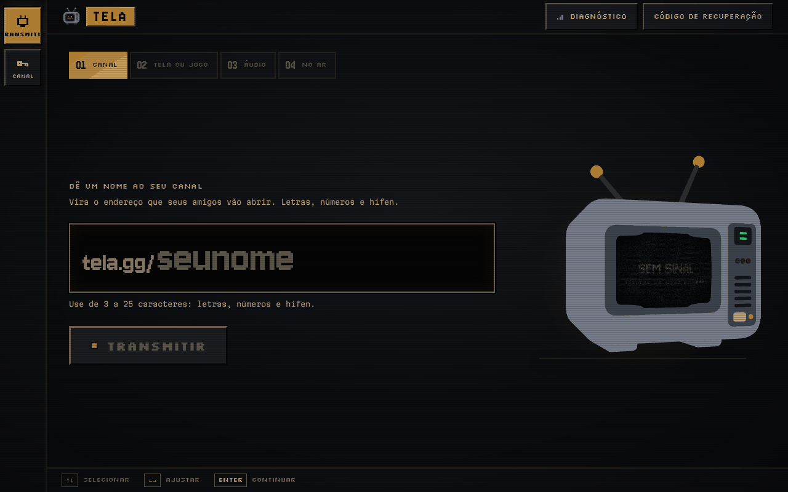
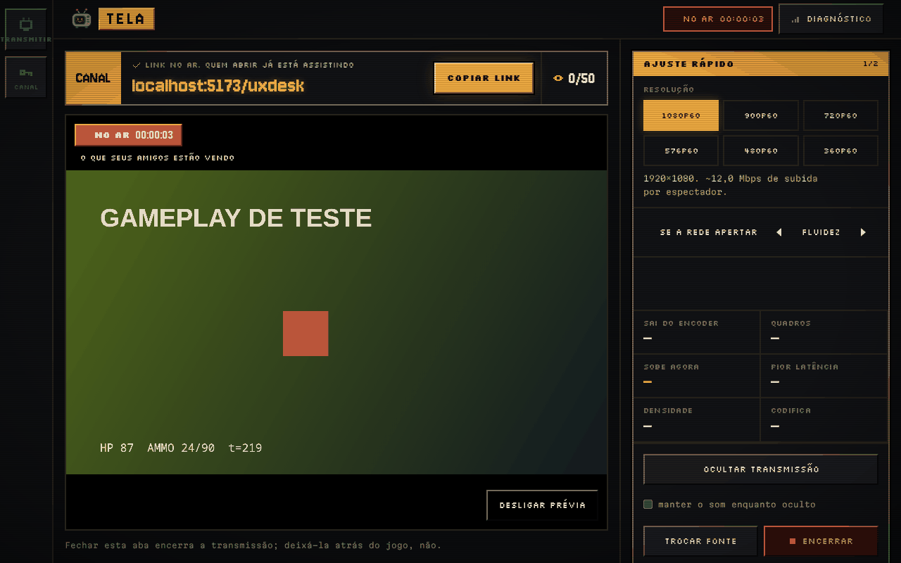
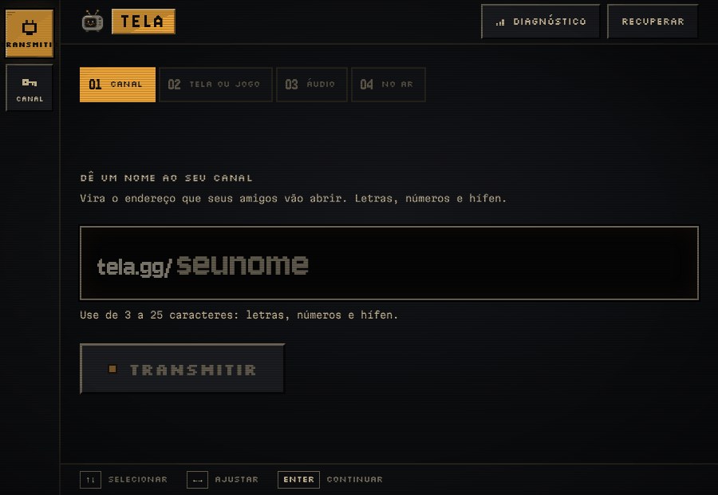
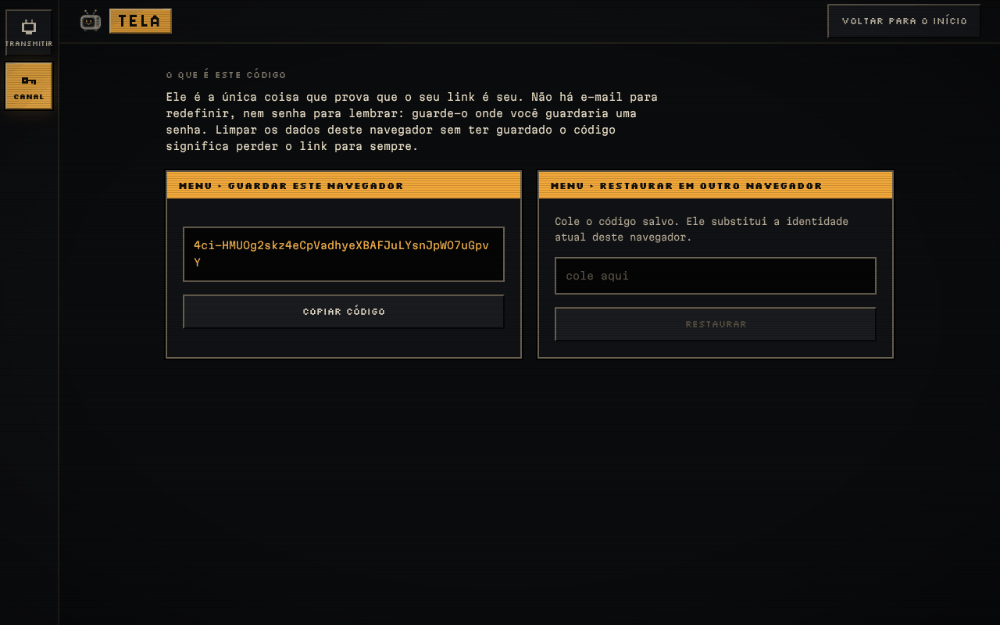

### 7.1 Achados do trilho atual

Medições em `desktop.html` (build `build:desktop`, 1280×800 e 900×620, sem `window.telaDesktop`: layout apenas).

| ID | Sev | Problema | Proposta | Esf |
|---|:-:|---|---|:-:|
| **D-01** | **3** | O rótulo "TRANSMITIR" do trilho (Silkscreen 9 px, botão de 60×60) vaza e sai cortado como "RANSMITIR" tanto no estado ativo (home) quanto no desabilitado (ao vivo). 9 px também está abaixo do piso de 11 px que o próprio `globals.css` declara para a fonte ("abaixo disso a Silkscreen vira borrão"). | Trilho de 76 para 88 px e rótulos de 10 a 11 px com palavras que cabem: `NO AR`, `ASSISTIR`, `CANAL`. Ou só ícone com `title` e `aria-label` e o nome inteiro no `tooltip` ao foco. | S |
| D-02 | 2 | O item "CANAL" (ícone de chave) abre `/recuperar`, cuja tela se chama "O QUE É ESTE CÓDIGO", e o cabeçalho ainda mostra "CÓDIGO DE RECUPERAÇÃO": três nomes para uma tela, e o ícone de chave não diz "canal". | `SEU CANAL` agrupa: link `tela.gg/slug` com copiar, código do canal (mascarado, R-01), e as preferências do app. Retirar o botão duplicado do cabeçalho no desktop. | S |
| D-03 | 2 | Ao vivo, os **dois** itens ficam `disabled` (`title="Ao vivo: encerre a transmissão antes de sair daqui"`): botão desabilitado não recebe foco, então a explicação é inalcançável por teclado e por toque, e o trilho inteiro parece quebrado. A pessoa fica sem como ir a nada nem voltar ao console se navegar. | Ao vivo, o item ativo vira `NO AR` (LED, tempo) e é o único alvo; os demais ficam visíveis com `aria-disabled="true"` e `title` acessível ao foco. Painel de status fixo no rodapé do app (plano §11: LED, tempo, `3/5`, rota, ENCERRAR). | M |
| D-04 | 1 | O cabeçalho da web (logo + DIAGNÓSTICO + CÓDIGO…) coexiste com o trilho: duas navegações no mesmo canto. O plano põe "Diagnóstico" no trilho. | No desktop, o cabeçalho perde a marca (a janela já se chama Tela) e DIAGNÓSTICO vai ao trilho. | S |
| D-05 | 1 | 900×620: o layout se mantém (o trilho ocupa 76 px e o conteúdo rola), mas o rodapé com legenda de teclas e o botão "TRANSMITIR" ficam apertados; sem estado de "modo compacto" (plano §11). | Abaixo de 760 px de largura, trilho de 56 px só com ícones. | M |
| D-06 | 0 | Ordem de Tab no desktop: trilho primeiro (`TRANSMITIR`, `CANAL`), depois cabeçalho e conteúdo. Coincide com a ordem visual. | Manter. | — |

### 7.2 Modo "ASSISTIR" dentro do app (proposta)

O app vai poder assistir. A organização do Discord (§11) vira: trilho **TRANSMITIR · ASSISTIR · CANAL · DIAG · AJUSTES**, painel **NO AR** no rodapé quando há transmissão ou sessão de assistir ativa.

**Tela ASSISTIR (home do modo)**

```text
┌────┬───────────────────────────────────────────────────────────┐
│ TV │  MENU ▸ ASSISTIR                                           │
│    │                                                            │
│ ▶  │   tela.gg/ [ joao_____________ ]       [ ENTRAR ▸ ]        │
│ASSI│                                                            │
│    │   Cole um link ou digite só o nome.                        │
│ …  │   RECENTES (neste computador)                              │
│    │   [joao ●] [mari] [guilherme]        LIMPAR                │
└────┴───────────────────────────────────────────────────────────┘
```

- **Campo único** que aceita `tela.gg/joao`, `https://tela.gg/joao` ou `joao` (extrai o slug). Enter entra.
- **Recentes** guardados só localmente (`localStorage`, últimos 5), com `LIMPAR`. É histórico pessoal, não diretório nem seguidores (R6); mesmo assim, confirmar com o dono. O ● marca "no ar agora" só se o canal estiver aberto numa sessão do app (nada de sondagem de slugs de terceiros).
- **Dentro do canal:** o conteúdo é a mesma rota de espectador (barra, zoom, volume, PiP), com três diferenças:
  1. O trilho recolhe para a borda (hover ou foco do teclado o traz) ao entrar em `AO VIVO`, para o vídeo ocupar a janela.
  2. `F` ou duplo clique leva a tela cheia do app (`BrowserWindow.setFullScreen`), `Esc` volta; `Ctrl+Shift+F` ativa **janela flutuante**: sempre no topo, 16:9, sem moldura, posição lembrada. É o jeito de assistir um amigo enquanto se joga (a pessoa já está numa call).
  3. A barra reaproveita o layout compacto (V-01) e mostra o estado da conexão por extenso: `DIRETA · 18 ms` (o painel NO AR do plano).
- **Espera:** a mesma sala de espera, com `AVISAR QUANDO ENTRAR NO AR`: notificação nativa do sistema, **só para a sessão que a pessoa está esperando agora**, sem lista de canais seguidos. Se a pessoa fecha a aba, o aviso some. Isso é uma exceção ao "sem seguidores" que o dono precisa aprovar (a web não faz).
- **Sem vaga:** `SEM VAGA · 5/5` e o app tenta entrar sozinho, igual à web.
- **Estados:** os mesmos textos de `OfflineState` (uma única fonte), corrigidos por V-03 a V-10.

**Regra de vagas.** Cada espectador é uma cópia inteira do vídeo saindo do transmissor (texto do popover da Sala). Se a pessoa estava na web e abre no app, **a aba da web deve sair antes**, senão ocupa duas vagas. Detalhe em 7.3.

### 7.3 "Abrir no app" na web (proposta)

Premissas: `tela.gg/x` abre no app quando instalado (link de app/protocolo registrado). A web não consegue saber com certeza que o app está instalado; a detecção por protocolo (`tela://canal/x`) só mostra se abriu pela perda de foco da aba, e não é infalível.

Princípios: nunca abrir sozinho; nunca por cima do vídeo; um aviso por sessão; a escolha da pessoa é lembrada.

| Situação | Onde aparece | Texto |
|---|---|---|
| Sala de espera / sintonizando (sem vídeo) | Ação secundária abaixo do texto do estado, no mesmo card | `ABRIR NO APP TELA` · link menor: `continuar no navegador` |
| Vídeo no ar | **Nada** na tela. Um item `Abrir no app` dentro de `⋯` da barra (junto de PiP e diagnóstico) | `Abrir no app` |
| Console do transmissor | Nada: quem transmite já está no app ou escolheu o navegador | — |
| Primeira visita, app não detectado | Sem aviso; só o link `BAIXAR O APP` no rodapé da sala de espera, **depois** do lançamento (B-07) | `Quer assistir em janela flutuante? Baixe o app.` |

**Fluxo de entrega ao app (com o app instalado):**

1. Clique em `ABRIR NO APP TELA`. A aba mostra `ABRINDO NO APP…` (LED piscando) por até 3 s.
2. O app recebe `tela://canal/joao` e conecta. Quando o app informa `AO VIVO` (ou "esperando"), a aba da web se desconecta e mostra `ESTA TRANSMISSÃO ESTÁ ABERTA NO APP. [VOLTAR PARA ESTA ABA]` (sem fechar a aba sozinha; fechar aba por script é bloqueado e seria presunçoso).
3. Se o app não responde em 3 s: `NÃO ENCONTRAMOS O APP. [TENTAR DE NOVO] [CONTINUAR NO NAVEGADOR]`. A web seguiu conectada o tempo todo (a vaga só é solta quando o app confirma), então nada se perde.
4. Escolha lembrada: `SEMPRE ABRIR NO APP` e `NÃO PERGUNTAR DE NOVO` num `<details>` do mesmo card; revogável em `AJUSTES ▸ APLICATIVO` do app (e em `Ajustes` da web, se existir).

**Texto sugerido** (verificável com o dono; evitar afirmar "menos latência" sem medir):
`Abra este canal no app do Tela. Janela flutuante e atalhos, sem usar o navegador.`

**O que o app faz ao receber o link.** Se já está transmitindo, ele **não** troca de tela: abre uma janela de assistir à parte (o trilho fica travado ao vivo, D-03) ou pergunta `VOCÊ ESTÁ NO AR. ABRIR em JANELA FLUTUANTE?`. Se o link é do canal do próprio usuário: abre o console (`TRANSMITIR`).

---

## 8. O que precisa de validação humana

(AGENTS.md: "Nunca escreva 'testado e funcionando' sobre algo que você não executou.")

| Ponto | Como validar |
|---|---|
| Espaço/Enter nos botões do espectador (A-01) | Chrome e Firefox reais, teclado físico: foco em `+`, Espaço e Enter; com leitor de tela (NVDA ou Orca) |
| Quadros descartados e consumo no espectador | MangoHud/PresentMon e `chrome://media-internals` numa máquina com GPU real |
| Tempo até o primeiro quadro e latência | Câmera a 240 fps; rede real com TURN |
| Popover da Sala cortado (C-01), plaqueta (C-04) | Em Chrome e Firefox, com 50 vagas |
| Contraste sob a camada CRT (W-01) | Medição por pixel de uma captura 1:1 em monitor real; verificar com `prefers-contrast: more` |
| Piscadas do chiado (2.3.1) | Ferramenta de análise de flashes (PEAT) numa gravação do estado "sintonizando" |
| Altura da barra em celular | iOS Safari e Chrome Android reais, em pé e deitado |
| "Abrir no app": protocolo e vaga dupla | Instalar o app (D1) e fazer o fluxo da seção 7.3 em Windows e Linux |
| Rótulo do trilho (D-01) | Em escalas de 100%, 125% e 150% no Windows |

## 9. Decisões e dúvidas

- Não alterei nenhum arquivo existente; só criei este documento e as capturas.
- Dois itens tocam decisões do dono e estão marcados como proposta: o atalho de retorno (B-05) e a notificação ao esperar (7.2). Um toca R6 de leve (recentes locais em ASSISTIR).
- Assumi que o app terá o protocolo `tela://` ou link de aplicativo; se for outro mecanismo, 7.3 muda nos passos 1 e 2, não nos princípios.
- A causa de `RecalcStyleCount` 33/s e o limite exato do plano de "plaqueta" (que parece depender de 0 espectadores e de ~5 s de inatividade) não foram investigados no código; descrevi o que observei.
- O diagnóstico de degradação em localhost (C-06) mostra o aviso com 2 espectadores: a decisão do governador não é avaliada aqui.
